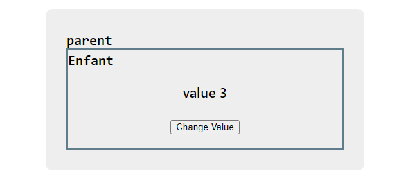

# cour 12 : **Communication entre les Composantes:**

-   **Description:**

    -   la communication du parent vers l'enfant est principalement réalisée via les `props`.

    -   les enfants peuvent informer les parents des événements en utilisant des callbacks passés via les prop.

-   **Bonnes Pratqiues:**

    -   En React, il est généralement recommandé de maintenir un flux de données unidirectionnel, c'est-à-dire que les données circulent du parent vers l'enfant. Cela aide à garder les composants découplés et facilite la gestion de l'état.

    -   il est préférable d'éviter que les composants enfants modifient directement l'état des composants parents. Cependant, les enfants peuvent informer les parents des événements en utilisant des callbacks passés via les props.

-   **Example 1:**

    -   **Problematqiue:**

        > On a un parent avec `value` comme état(`state`), et l'enfant de ce parent est celui qui présente cette valeur. L'enfant possède un button pour changer la valeur de cette value

        

    -   **Solution 1:**

        ```jsx
        import { useState } from "react";
        import Enfant from "./Enfant";
        import "./Parent.css";

        export default function Parent() {
            const [value, setValue] = useState("value 1");

            return (
                <>
                    <div className="parent">
                        <div style={{ textAlign: "left" }}>
                            <code>parent</code>
                        </div>
                        <Enfant value={value} handelChange={setValue} />
                    </div>
                </>
            );
        }


        export default function Enfant({ value, handelChange }) {
            let count = 1;
            function handelClick() {
                count++;
                handelChange("value " + count);
            }
            return (
                <>
                    <div className="enfant">
                        <div style={{ textAlign: "left" }}>
                            <code>Enfant</code>
                        </div>

                        <p>{value}</p>
                        <button onClick={handelClick}>Change Value</button>
                    </div>
                </>
            );
        }
        ```

    -   **Solution 2:**

        ```jsx
        import { useState } from "react";
        import Enfant from "./Enfant";
        import "./Parent.css";

        export default function Parent() {
            const [value, setValue] = useState("value 1");

            function handelChange(v) {
                setValue(v);
            }

            return (
                <>
                    <div className="parent">
                        <div style={{ textAlign: "left" }}>
                            <code>parent</code>
                        </div>
                        <Enfant value={value} handelChange={handelChange} />
                    </div>
                </>
            );
        }


        export default function Enfant({ value, handelChange }) {
            let count = 1;
            function handelClick() {
                count++;
                handelChange("value " + count);
            }
            return (
                <>
                    <div className="enfant">
                        <div style={{ textAlign: "left" }}>
                            <code>Enfant</code>
                        </div>

                        <p>{value}</p>
                        <button onClick={handelClick}>Change Value</button>
                    </div>
                </>
            );
        }
        ```

### RQ : **Pourquoi éviter que les composants enfants modifient directement l'état des composants parents ?**

-   **Maintien de la hiérarchie claire des composants** : Les parents contrôlent l'état, les enfants reçoivent les données et déclenchent des actions via des callbacks.

-   **Prévention des effets secondaires imprévus** : Si un enfant pouvait directement modifier l'état d'un parent, il pourrait entraîner des mises à jour de l'interface utilisateur inattendues ou des comportements difficiles à déboguer.

-   **Simplicité et prévisibilité** : En maintenant un flux de données unidirectionnel, il est plus facile de comprendre et de prédire comment les données et les états sont propagés dans l'application.
