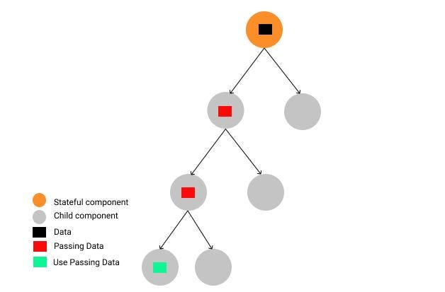
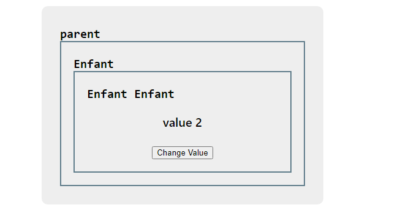

# cour 13 : **Prop Drilling:**

## 1. **Description:**

-   En React, le problème de `prop drilling` (forage de props) se produit lorsque vous avez plusieurs niveaux de composants imbriqués et que vous devez passer des props à travers plusieurs niveaux pour qu'un composant enfant puisse y accéder. Cela peut rendre le code difficile à maintenir et à comprendre, surtout si vous avez beaucoup de composants intermédiaires qui ne font qu'acheminer les props sans les utiliser eux-mêmes.



## 2. **Exemple 1:**

-   Supposons que vous ayez un composant `App` qui doit passer une prop `user` à un composant `Profile`, mais que `Profile` est imbriqué plusieurs niveaux en dessous dans la hiérarchie des composants.

-   Dans cet exemple, la prop `user` est passée du composant `App` au composant `Profile` en traversant `Navbar` et `Settings`. Les composants `Navbar` et `Settings` ne font qu'acheminer la prop `user` sans l'utiliser eux-mêmes, ce qui entraîne du "prop drilling".

```jsx
const App = () => {
    const user = { name: "Alice", age: 25 };

    return (
        <div>
            <Navbar user={user} />
            <MainContent user={user} />
        </div>
    );
};

const Navbar = ({ user }) => (
    <nav>
        <span>Welcome, {user.name}</span>
        <Settings user={user} />
    </nav>
);

const Settings = ({ user }) => (
    <div>
        <Profile user={user} />
    </div>
);

const Profile = ({ user }) => (
    <div>
        <h1>{user.name}'s Profile</h1>
        <p>Age: {user.age}</p>
    </div>
);
```

## 3. **Exemple 2:**

-   **Probléme:**

    > Le parent a une valeur `value` et son fils direct n'utilise pas cette valeur, mais c'est plutôt son petit-fils qui l'utilise. Ainsi, le fils direct du parent ne fait que transporter cette valeur vers le fils suivant via les `props`, ce qui constitue un problème de "prop drilling".

    

-   **code:**

    ```jsx
    // ========================================== Parent =============================================
    import { useState } from "react";
    import Enfant from "./Enfant";
    import "./Parent.css";

    export default function Parent() {
        const [value, setValue] = useState("value 1");

        function handelChange(v) {
            setValue(v);
        }

        return (
            <>
                <div className="parent">
                    <div style={{ textAlign: "left" }}>
                        <code>parent</code>
                    </div>
                    <Enfant value={value} handelChange={handelChange} />
                </div>
            </>
        );
    }

    // ========================================== fils  =============================================

    import Enfant2 from "./EnFant2";

    export default function Enfant({ value, handelChange }) {
        return (
            <>
                <div className="enfant">
                    <div style={{ textAlign: "left" }}>
                        <code>Enfant</code>
                    </div>
                    <Enfant2 value={value} handelChange={handelChange} />
                </div>
            </>
        );
    }

    // ========================================== fils de fils  =============================================

    export default function Enfant2({ value, handelChange }) {
        let count = 1;
        function handelClick() {
            count++;
            handelChange("value " + count);
        }
        return (
            <>
                <div className="enfant">
                    <div style={{ textAlign: "left" }}>
                        <code>Enfant Enfant</code>
                    </div>

                    <p>{value}</p>
                    <button onClick={handelClick}>Change Value</button>
                </div>
            </>
        );
    }

    ```
