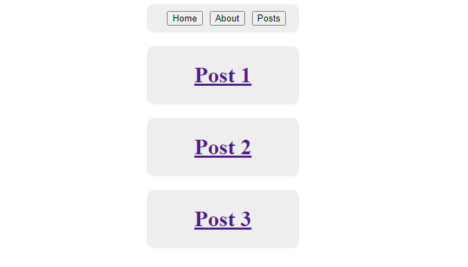
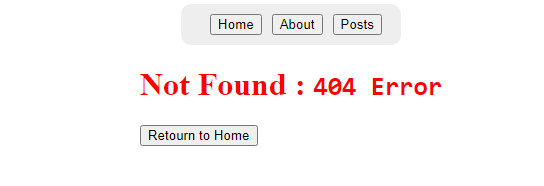

# cour 16 : **Router dynamique**

## 1. **Le routing dynamique en React:**

-   **Description:**

    > Le routing dynamique en React permet de créer des routes qui changent en fonction des données ou des paramètres dynamiques. React Router, la bibliothèque standard pour le routing dans les applications React, offre des fonctionnalités puissantes pour créer des routes dynamiques.

    Le routing dynamique est utile pour des scénarios tels que :

    -   Afficher des pages de détails pour différents éléments (par exemple, les profils des utilisateurs).
    -   Créer des chemins URL basés sur les données (par exemple, `/posts/:postId`).

-   **Syntaxe:**

    ```jsx
    <Routes>
        <Route path="/chemin1/:nomVar" element={<Component atrr={"value"} />} />
    </Routes>
    ```

    -   `/:nomVar` : indique que le `path` spécifie est un `router` dynamique qui change selon la valeur du `nomVar`

-   **Exemple:**

    Supposons que nous avons une application avec une liste d'articles, et nous voulons afficher les détails de chaque article lorsqu'un utilisateur clique sur un article spécifique.

    ```jsx
    import React from "react";
    import { BrowserRouter as Router, Routes, Route } from "react-router-dom";
    import Home from "./Home";
    import Article from "./Article";

    const App = () => {
        return (
            <Router>
                <Routes>
                    <Route path="/" element={<Home />} />
                    <Route path="/article/:id" element={<Article />} />
                </Routes>
            </Router>
        );
    };

    export default App;
    ```

## 2. **`useParams`**

-   **Description:**

    > Le hook `useParams` de React Router est un outil puissant qui permet d'accéder aux paramètres de la route actuelle. Il est souvent utilisé pour récupérer les valeurs dynamiques des URL dans les composants, facilitant ainsi la création de pages dynamiques basées sur ces paramètres.

    -   `useParams` est un hook fourni par React Router pour accéder aux paramètres dynamiques des routes. Lorsqu'une route contient des segments dynamiques (par exemple, `/article/:id`), `useParams` peut être utilisé pour extraire la valeur de ces segments et les utiliser dans votre composant.

-   **Syntaxe:**

    ```jsx
    const params = useParams();
    ```

    -   `useParams` retourne un objet où les clés sont les noms des segments dynamiques définis dans la route et les valeurs sont les valeurs actuelles de ces segments.

-   **Exemple:** Supposons que nous avons une application avec des articles, et nous voulons afficher les détails de chaque article lorsqu'un utilisateur clique sur un lien spécifique.

    ```jsx
    import "./App.css";
    import { Route, Routes, Link } from "react-router-dom";
    import Home from "./components/Home/Home";
    import About from "./components/About/About";
    import Posts from "./components/Posts/Posts";
    import PostDetailles from "./components/PostDetailles/PostDetailles";
    import { PostContext } from "./context/PostContext";
    // ================================================= App ==================================
    function App() {
        const posts = [
            {
                id: 1,
                title: "Post 1",
                body: "La seule façon de faire du bon travail, c'est d'aimer ce que vous faites",
            },
            {
                id: 2,
                title: "Post 2",
                body: "Commencez votre journée par la tâche la plus difficile. Cela vous donne un sentiment d'accomplissement et rend les autres tâches plus faciles à gérer",
            },
            {
                id: 3,
                title: "Post 3",
                body: "Essayez de cuisiner un plat traditionnel d'un pays étranger ce week-end ! Cela peut être une excellente façon de voyager sans quitter votre cuisine",
            },
        ];

        return (
            <>
                <PostContext.Provider value={posts}>
                    <div className="nav">
                        <Link to={"/"}>
                            <button>Home</button>
                        </Link>
                        <Link to={"about"}>
                            <button>About</button>
                        </Link>
                        <Link to={"/posts"}>
                            <button>Posts</button>
                        </Link>
                    </div>
                    <Routes>
                        <Route path="/" element={<Home />} />
                        <Route path="/about" element={<About />} />
                        <Route path="/posts" element={<Posts />} />
                        <Route
                            path="/postDetailles/:postId"
                            element={<PostDetailles />}
                        />
                    </Routes>
                </PostContext.Provider>
            </>
        );
    }

    export default App;
    ```

    ```jsx
    // =================================================  Posts =======================================
    import "./Post.css";
    import { Link } from "react-router-dom";
    import { PostContext } from "../../context/PostContext";
    import { useContext } from "react";

    export default function Posts() {
        const posts = useContext(PostContext);
        const postList = posts.map((ele) => {
            return (
                <div key={ele.id} className="post">
                    <Link to={"/postDetailles/" + ele.id}>
                        <h1>{ele.title}</h1>
                    </Link>
                </div>
            );
        });

        return <>{postList}</>;
    }
    ```

    ```jsx
    // ================================================  PostsDetailles ==========================================
    import { useParams } from "react-router-dom";
    import { PostContext } from "../../context/PostContext";
    import { useContext } from "react";

    export default function PostDetailles() {
        let { postId } = useParams();
        postId = parseInt(postId);
        const posts = useContext(PostContext);
        const post = posts.filter((ele) => ele.id === postId)[0];
        console.log(post);

        return (
            <>
                <div>
                    <h1>{post.title}</h1>
                    <p>{post.body}</p>
                </div>
            </>
        );
    }
    ```

-   **`url` /posts/:**

    

-   **`url` /posts/1:**

    

## 3. **Page :Not Found 404:**

-   **Description de l'erreur 404:**

    > L'erreur 404 est un code de statut HTTP qui indique que le serveur n'a pas trouvé la ressource demandée. Dans une application web, cela signifie généralement que l'utilisateur a essayé d'accéder à une URL qui n'existe pas. Une page 404 personnalisée améliore l'expérience utilisateur en fournissant une rétroaction claire et en guidant l'utilisateur vers d'autres parties du site.

-   **Syntaxe pour gérer les pages 404 avec React Router:**

    Dans React Router, vous pouvez définir une route de type `catch-all` pour gérer les erreurs 404 en utilisant le chemin `*`. Cela capture toutes les URL qui ne correspondent à aucune des routes définies précédemment et affiche une page de "Not Found".

    ```jsx
    <Route path="*" element={<NotFound />} />
    ```

-   **Exemple complet:**

    ```jsx
    // ========================== NotFound ==========================
    import { Link } from "react-router-dom";

    export default function NotFound() {
        return (
            <div
                style={{
                    color: "red",
                }}
            >
                <h1>
                    Not Found : <code>404 Error</code>
                </h1>
                <Link to={"/"}>
                    <button>Retourn to Home</button>
                </Link>
            </div>
        );
    }
    // ================================= App =================================
    import "./App.css";
    import { Route, Routes, Link } from "react-router-dom";
    import Home from "./components/Home/Home";
    import About from "./components/About/About";
    import Posts from "./components/Posts/Posts";
    import PostDetailles from "./components/PostDetailles/PostDetailles";
    import { PostContext } from "./context/PostContext";
    import NotFound from "./components/NotFound/NotFound";

    function App() {

        return (
            <>
                <PostContext.Provider value={posts}>
                    <div className="nav">
                        <Link to={"/"}>
                            <button>Home</button>
                        </Link>
                        <Link to={"about"}>
                            <button>About</button>
                        </Link>
                        <Link to={"/posts"}>
                            <button>Posts</button>
                        </Link>
                    </div>
                    <Routes>
                        <Route path="/" element={<Home />} />
                        <Route path="/about" element={<About />} />
                        <Route path="/posts" element={<Posts />} />
                        <Route
                            path="/postDetailles/:postId"
                            element={<PostDetailles />}
                        />
                        <Route path="*" element={<NotFound />} />
                    </Routes>
                </PostContext.Provider>
            </>
        );
    }

    export default App;

    ```

-   **si l'utilisateur visite par exemple le url : `/zzz`:**

    

-   **Exemple 2:**

    ```jsx
    // ============================= App ==============================
    const App = () => {
        return (
            <Router>
                <Routes>
                    <Route path="/" element={<Home />} />
                    <Route path="/article/:id" element={<Article />} />
                    <Route path="*" element={<NotFound />} />
                </Routes>
            </Router>
        );
    };

    // =============================== Article ============================
    import React from "react";
    import { useParams } from "react-router-dom";

    const Article = () => {
        const { id } = useParams();

        // Simulation de récupération de données d'article
        const article = {
            1: { title: "Article 1", content: "Contenu de l'article 1" },
            2: { title: "Article 2", content: "Contenu de l'article 2" },
            3: { title: "Article 3", content: "Contenu de l'article 3" },
        }[id];

        if (!article) {
            return <p>Article non trouvé</p>;
        }

        return (
            <div>
                <h1>{article.title}</h1>
                <p>{article.content}</p>
            </div>
        );
    };

    export default Article;
    ```
