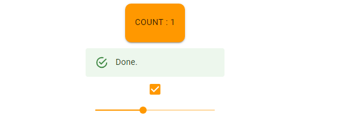

## cour 02 : **`Theme`:**

-   **Description:**

    -   La fonction `createTheme` de Material-UI est utilisée pour créer un thème personnalisé pour votre application React. Un thème permet de définir des styles globaux comme les couleurs, les typographies, les espacements, etc., et de les appliquer de manière cohérente à travers tous les composants de votre application.

    -   **`ThemeProvider`** : Ce composant de Material-UI permet d'appliquer le thème personnalisé à l'ensemble de votre application ou à une partie spécifique de celle-ci.

-   **Syntaxe:**

    ```javascript
    import { createTheme, ThemeProvider } from "@mui/material/styles";

    const theme = createTheme({
        palette: {
            primary: {
                main: "#1976d2",
            },
            secondary: {
                main: "#dc004e",
            },
        },
        typography: {
            h1: {
                fontSize: "2.5rem",
                fontWeight: "bold",
            },
            body1: {
                fontSize: "1rem",
            },
        },
        spacing: 8, // Définir l'unité de base pour les espacements
        // Autres personnalisations possibles
    });
    ```

    ```jsx
    <ThemeProvider theme={theme}>
        // les autres composnates
        <Component1 color="primary" />
        <Component2 color="secondary" />
    </ThemeProvider>
    ```

-   **Exemple:**

    ```jsx
    import "./App.css";
    import Stack from "@mui/material/Stack";
    import Alert from "@mui/material/Alert";
    import Button from "@mui/material/Button";
    import { useState } from "react";
    import { createTheme } from "@mui/material";
    import { ThemeProvider } from "@mui/material";
    import { orange, purple } from "@mui/material/colors";
    import Checkbox from "@mui/material/Checkbox";
    import Slider from "@mui/material/Slider";

    function App() {
        // creation d'une theme de notre App :
        const theme = createTheme({
            palette: {
                primary: {
                    main: orange[500],
                },
                secondary: {
                    main: purple[200],
                },
            },
        });


        }
        const label = { inputProps: { "aria-label": "Checkbox demo" } };
        return (
            <>
                <ThemeProvider theme={theme}>
                    <div className="flex">
                        <Stack spacing={2} direction="row">
                            <Button variant="contained" color="primary">
                              button
                            </Button>
                        </Stack>
                        <Alert severity="success">Done.</Alert>
                        <Checkbox {...label} defaultChecked />
                        <Slider
                            size="small"
                            defaultValue={70}
                            aria-label="Small"
                            valueLabelDisplay="auto"
                            style={{
                                width: "200px",
                            }}
                        />
                    </div>
                </ThemeProvider>
            </>
        );
    }

    export default App;
    ```


