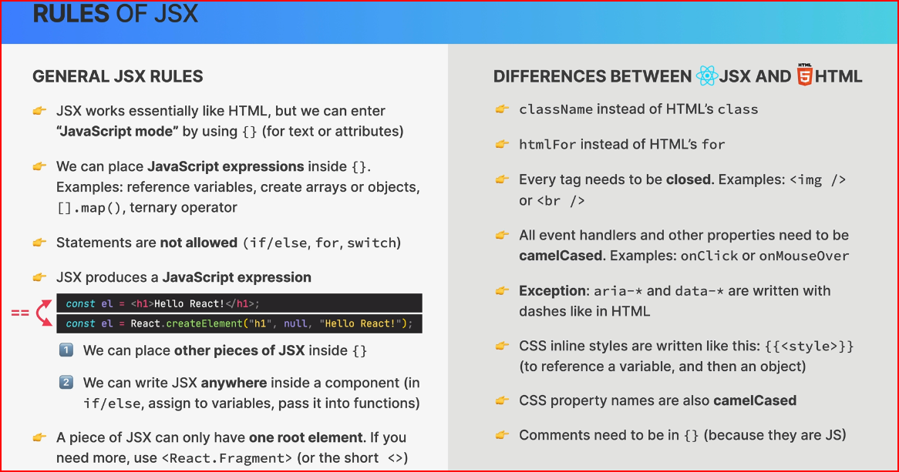

# cour 03 **`JSX`:**

## 1. **Definition:**

> JSX, ou JavaScript XML, est une extension de syntaxe pour JavaScript utilisée avec React. Il permet d'écrire du HTML directement dans le code JavaScript, rendant la création d'interfaces utilisateur plus intuitive et proche de la structure HTML traditionnelle.

## 2. **Syntaxe du JSX:**

1. **Éléments HTML dans JavaScript** : Vous pouvez écrire des éléments HTML directement dans votre code JavaScript.

    ```jsx
    const element = <h1>Hello, World!</h1>; // JSX Expression : element = Recat.createElement('h1' , null , "Hello, World!")
    ```

2. **Expressions JavaScript** : Les expressions JavaScript peuvent être incluses dans le JSX en les entourant d'accolades `{}`.

    ```jsx
    const name = "Alice";
    const element = <h1>Hello, {name}!</h1>;
    ```

3. **Attributs et Classes** :Les attributs sont définis de manière similaire à HTML, mais avec quelques différences notables, comme `className` au lieu de `class`.

    ```jsx
    const element = (
    	<div className="container nomclass2" nomAttr={value}>
    		Content
    	</div>
    );
    ```

4. **Fragments** : Pour retourner plusieurs éléments sans un conteneur HTML additionnel, vous pouvez utiliser `React.Fragment` ou la syntaxe courte `<> </>`.

    ```jsx
    import React from "react";

    function MyComponent() {
    	return (
    		<>
    			<h1>Hello, World!</h1>
    			<p>This is a React component.</p>
    		</>
    		// ou <React.Fragment key={"blabla"}></React.Fragment> for list
    	);
    }
    ```

## 3. **Régles:**

-   En React, lors de l'utilisation de l'interpolation des expressions JavaScript dans JSX avec des accolades `{}`, vous pouvez utiliser des expressions simples mais pas des objets JavaScript directement.

-   en JSX, chaque balise doit être fermée correctement : `<input type="text" />`

-   en JSX , chaque composant doit retourner **un seul élément HTML parent**

-   en JSX et React, les noms d'attributs CSS sont écrits en `camelCase`, pas en kebab-case comme on pourrait le voir dans un fichier CSS régulier comme `backgroundColor`.



## 4. **Rendu en React:**

> En React, voici les types de valeurs que JSX peut **rendre dans le DOM** :

-   **Chaînes de caractères (`string`)**

    React peut directement afficher du texte dans une balise.

    ```jsx
    const element = <div>Bonjour, React !</div>;
    ```

    Cela affichera :

    ```html
    <div>Bonjour, React !</div>
    ```

-   **Nombres (`number`)**

    Les nombres sont convertis en texte et affichés directement.

    ```jsx
    const element = <p>{42}</p>; // Affichera "42"
    ```

    ⚠️ **Attention : `0` est un nombre valide et s'affichera !**

    ```jsx
    const element = <p>{0}</p>; // Affichera "0"
    ```

-   **Éléments React (`JSX` ou `React.createElement`)**

    React peut afficher des composants et du JSX imbriqué.

    ```jsx
    const element = (
    	<div>
    		<h1>Titre</h1>
    		<p>Paragraphe</p>
    	</div>
    );
    ```

-   **Tableaux (`Array`)**

    Les tableaux de valeurs valides (strings, nombres, JSX) seront affichés sans séparateurs.

    ```jsx
    const element = <div>{["Bonjour", " ", "React"]}</div>;
    // Affichera : Bonjour React
    ```

-   **Fragments (`React.Fragment`)**

    Les fragments permettent d'afficher plusieurs éléments sans ajouter de `div` supplémentaire.

    ```jsx
    const element = (
    	<>
    		<h1>Titre</h1>
    		<p>Texte</p>
    	</>
    );
    ```

    Cela produira :

    ```html
    <h1>Titre</h1>
    <p>Texte</p>
    ```

| Type                                                                               | Rendu en React ? | Remarque                                |
| ---------------------------------------------------------------------------------- | ---------------- | --------------------------------------- |
| `string`                                                                           | ✅ Oui           | Affiché directement                     |
| `number`                                                                           | ✅ Oui           | Converti en texte                       |
| `JSX` / `React.createElement`                                                      | ✅ Oui           | Affiché normalement                     |
| `Array`                                                                            | ✅ Oui           | Affiché en concaténation                |
| `React.Fragment`                                                                   | ✅ Oui           | Permet d’éviter une `<div>` inutile     |
| **Tout le reste (`boolean`, `null`, `undefined`, `object`, `function`, `Symbol`)** | ❌ Non           | Doit être converti en `string` ou évité |

## 5. **Non Rendu en React :**

> En React, certains types de valeurs **ne sont pas rendus** dans le DOM lorsqu'ils sont inclus dans du JSX. Voici ce que React **ne rend pas** :

-   **Booleans (`true` et `false`)**

    Si vous passez `true` ou `false` dans du JSX en dehors d’un attribut, ils ne s'afficheront pas à l’écran :

    ```jsx
    const element = <div>{true}</div>; // Rien ne sera affiché
    ```

    Cela est utile pour des conditions, comme dans :

    ```jsx
    {
    	isLoggedIn && <p>Bienvenue !</p>;
    }
    ```

    Si `isLoggedIn` est `false`, rien ne sera affiché.

-   **`null` et `undefined`**

    React ignore aussi ces valeurs et n’affiche rien :

    ```jsx
    const element = <div>{null}</div>; // Rien ne s'affiche
    const element2 = <div>{undefined}</div>; // Rien ne s'affiche
    ```

    Mais attention : si vous mettez `{someVariable}` et que `someVariable` est `undefined`, React ne mettra rien, ce qui peut poser problème si vous voulez voir une valeur.

-   **Symboles (`Symbol()`)**

    React ne peut pas afficher des symboles dans le JSX :

    ```jsx
    const element = <div>{Symbol("test")}</div>; // Erreur !
    ```

    Si vous voulez afficher un `Symbol`, il faut le convertir en string :

    ```jsx
    const element = <div>{String(Symbol("test"))}</div>; // Affiche "Symbol(test)"
    ```

-   **Fonctions**

    Si vous passez une fonction directement dans du JSX, React ne sait pas comment l'afficher :

    ```jsx
    const myFunction = () => "Hello";
    const element = <div>{myFunction}</div>; // Erreur !
    ```

    Si vous voulez afficher le résultat d'une fonction, il faut l’appeler :

    ```jsx
    const element = <div>{myFunction()}</div>; // Affiche "Hello"
    ```

-   **Objets purs**

    React ne sait pas comment afficher un objet directement :

    ```jsx
    const obj = { name: "Alice" };
    const element = <div>{obj}</div>; // Erreur !
    ```

    Si vous voulez afficher un objet, vous devez le convertir en string :

    ```jsx
    const element = <div>{JSON.stringify(obj)}</div>; // Affiche {"name":"Alice"}
    ```

| Type                 | Rendu en React ?                      |
| -------------------- | ------------------------------------- |
| `true` / `false`     | ❌ (Ne s'affiche pas)                 |
| `null` / `undefined` | ❌ (Ne s'affiche pas)                 |
| `Symbol()`           | ❌ (Erreur)                           |
| Fonction             | ❌ (Erreur si non appelée)            |
| Objet                | ❌ (Erreur si non converti en string) |
