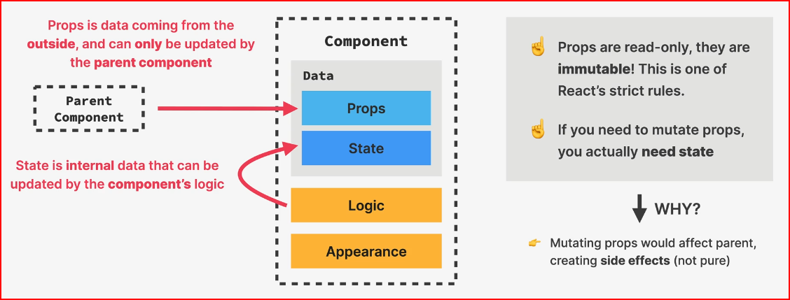
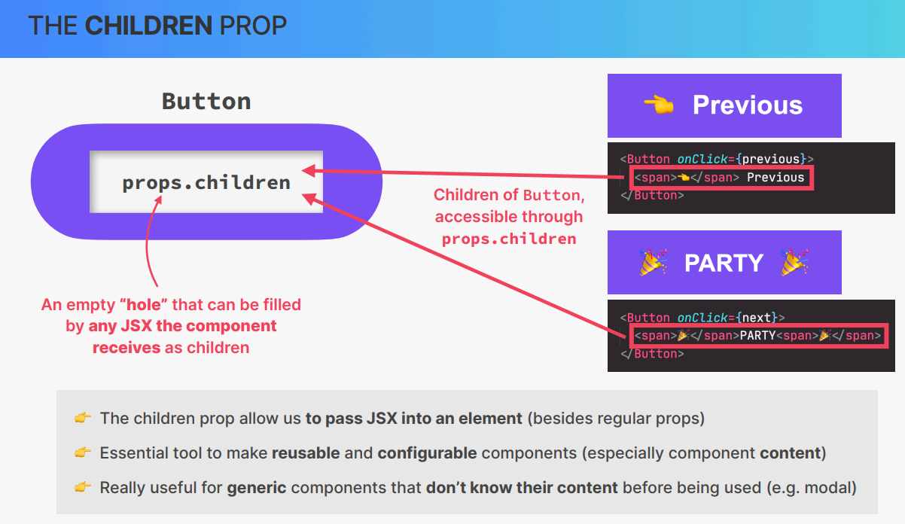

# cour 05 : **`props`**

## 1. **Les Props en React:**

-   **Description:**

    > Les `props` (abréviation de "properties") sont un mécanisme de React permettant de passer des données d'un composant parent à un composant enfant. Les props sont immuables, ce qui signifie qu'un composant enfant ne peut pas modifier ses props directement. Les props sont utilisées pour rendre les composants plus dynamiques et réutilisables.

    -   **Props**: Les props sont des **objets** passés aux composants React depuis leurs parents. Elles contiennent les données et les instructions dont les composants ont besoin pour fonctionner.
    -   **Immuables (`READ ONLY`)**: Une fois définies, les props ne peuvent pas être modifiées par le composant enfant.
    -   **Passage des Props (`ONE-WAY DATA FLOW`)**: Les props sont passées de haut en bas dans l'arbre des composants (du parent à l'enfant).



-   **Syntaxe:**

    -   **Syntaxe de base pour passer des props:**

        ```jsx
        // Composant parent
        import React from 'react';
        import Enfant from './Enfant';

        function Parent() {
        return (
            <div>
            <Enfant nomAttribut="value" /> // nom Attribut doit étre en camelCase
            </div>
        );
        }

        export default Parent;

        // Composant enfant
        import React from 'react';

        function Enfant(props) {
        return (
            <div>
            <h1>{props.nomAttribut}</h1>
            </div>
        );
        }

        export default Enfant;
        ```

    -   **Utilisation de destructuration pour les props:**

        ```jsx
        // Composant enfant
        import React from "react";

        function Enfant({ nomAttribut }) {
        	return (
        		<div>
        			<h1>{nomAttribut}</h1>
        		</div>
        	);
        }

        export default Enfant;
        ```

-   **Exemple Complet:**

    -   **Composant Parent:**

        ```jsx
        // Parent.js
        import React from "react";
        import Enfant from "./Enfant";

        function Parent() {
        	const message = "Hello from Parent Component!";
        	const user = {
        		name: "Alice",
        		age: 25,
        	};

        	return (
        		<div>
        			<h1>Parent Component</h1>
        			<Enfant message={message} user={user} />
        		</div>
        	);
        }

        export default Parent;
        ```

    -   **Composant Enfant:**

        ```jsx
        // Enfant.js
        import React from "react";

        function Enfant({ message, user }) {
        	return (
        		<div>
        			<h2>Enfant Component</h2>
        			<p>{message}</p>
        			<p>User Name: {user.name}</p>
        			<p>User Age: {user.age}</p>
        		</div>
        	);
        }

        export default Enfant;
        ```

## 2. **Les `children` Props en React:**

-   **Description:**

    > Les `children` props sont une fonctionnalité spéciale de React permettant de passer des composants enfants au composant parent. Cela permet de composer des interfaces utilisateur de manière flexible et modulaire. Le `children` prop est une propriété implicite qui représente les éléments enfants inclus à l'intérieur d'un composant dans le JSX.

    -   **`children` Prop**: Représente le contenu inclus entre les balises ouvrante et fermante d'un composant.
    -   **Utilisation**: Permet de rendre un composant plus flexible en lui permettant d'inclure des éléments enfants dynamiques.
    -   **Accès aux `children`**: Les `children` sont accessibles dans le composant via `props.children`.

-   **Syntaxe:**

    ```jsx
    // Composant parent avec des enfants
    <ComposantParent>
    	<div>Enfant 1</div>
    	<div>Enfant 2</div>
    </ComposantParent>;

    // Composant parent utilisant les children props
    import React from "react";

    function ComposantParent(props) {
    	return <div>{props.children}</div>;
    }

    export default ComposantParent;
    ```

-   **Exemple Complet:**

    -   **Composant Parent:**

        ```jsx
        // Parent.js
        import React from "react";
        import Conteneur from "./Conteneur";

        function Parent() {
        	return (
        		<div>
        			<h1>Parent Component</h1>
        			<Conteneur>
        				<p>Je suis un enfant 1</p>
        				<p>Je suis un enfant 2</p>
        				<p>Je suis un enfant 3</p>
        			</Conteneur>
        		</div>
        	);
        }

        export default Parent;
        ```

    -   **Composant Conteneur:**

        ```jsx
        // Conteneur.js
        import React from "react";

        function Conteneur({ children }) {
        	return (
        		<div>
        			<h2>Conteneur Component</h2>
        			<div className="contenu">{children}</div>
        		</div>
        	);
        }

        export default Conteneur;
        ```



### RQ : En React, les **props** (propriétés) peuvent accepter une grande variété de valeurs, selon ce que vous souhaitez passer à un composant

-   **Valeurs primitives**

    -   **Strings** : `title="Bonjour"`
    -   **Numbers** : `count={42}`
    -   **Booleans** : `isActive={true}` (ou simplement `isActive` qui équivaut à `true`)
    -   **Null & Undefined** : `value={null}` ou `value={undefined}`

-   **Objets et Tableaux**

    -   **Objets** : `user={{ name: "Alice", age: 25 }}`
    -   **Tableaux** : `items={['React', 'Vue', 'Angular']}`

-   **Fonctions**

    -   Vous pouvez passer des fonctions comme props pour gérer des événements.
        ```jsx
        <Button onClick={() => alert("Clique !")} />
        ```

-   **Composants React**

    -   Vous pouvez passer un composant React en tant que prop.
        ```jsx
        <Wrapper component={<Header />} />
        ```
