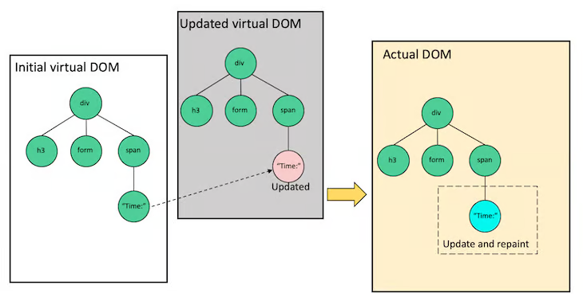

# cour 08 : **DOM virtuel (Virtual DOM) en React:**

## 1. **Définition:**

> Le DOM virtuel (Virtual DOM) en React est une abstraction du DOM (Document Object Model) réel et est utilisé pour améliorer les performances des applications web.

- Le DOM virtuel est une copie légère du DOM réel. Lorsqu'un composant React est rendu, React construit un arbre de nœuds virtuels qui correspondent aux éléments React. Ce processus se fait à chaque rendu de composant. L'arbre du DOM virtuel est ensuite comparé à la version précédente du DOM virtuel pour détecter les différences.

## 2. **Fonctionnement:**

1. **Rendu Initial** : Lorsqu'une application React est chargée pour la première fois, le DOM virtuel est créé pour représenter la structure initiale de l'interface utilisateur.

2. **Mises à Jour** : Lorsqu'une mise à jour est déclenchée, par exemple en réponse à un changement de state ou de props, React compare l'arbre du DOM virtuel actuel avec la version précédente.

3. **Diffing** : React détecte les différences entre les deux arbres du DOM virtuel à l'aide d'un algorithme de différenciation efficace. Il identifie les nœuds qui ont été ajoutés, modifiés ou supprimés.

4. **Mise à Jour Sélective** : Seules les parties du DOM réel qui ont changé sont mises à jour dans le navigateur. Cela permet d'éviter les mises à jour coûteuses et inefficaces de l'ensemble de l'interface utilisateur.

## 3. **Avantages:**

- **Performances Améliorées** : En évitant de manipuler directement le DOM réel à chaque mise à jour, React peut optimiser les opérations de rendu pour des performances plus rapides.
- **Réactivité** : Les mises à jour sélectives du DOM permettent de rendre l'interface utilisateur réactive aux changements de données, sans sacrifier les performances.
- **Conservation de l'État** : Le DOM virtuel permet à React de garder une trace de l'état actuel de l'interface utilisateur, ce qui facilite la gestion des mises à jour.
