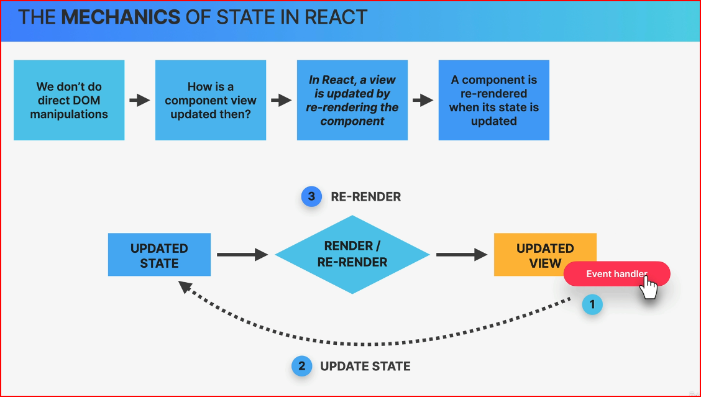

# cour 08 : **State**

## 1. **Introduction:**

-   **Définition du State en React:**

    > **State:** en React est un objet qui représente l'état interne d'un composant. Il contient des données spécifiques au composant qui peuvent changer au fil du temps, souvent en réponse à des actions de l'utilisateur ou à d'autres événements. Le state permet aux composants React de devenir dynamiques et interactifs, rendant possibles les mises à jour de l'interface utilisateur en fonction des changements de données.

-   **Gestion de l'État (`State Management`) en React:**

    > **Gestion de l'état** en React se réfère aux pratiques et outils utilisés pour gérer la manière dont l'état est stocké, mis à jour et partagé entre les différents composants d'une application. Une gestion efficace de l'état assure que les composants réagissent correctement aux changements de données, maintenant ainsi la synchronisation entre l'interface utilisateur et les données sous-jacentes.

-   **Niveaux de Gestion de l'État en React:**

    1. **État Local**: Géré au sein d'un seul composant. Il est utilisé pour les données spécifiques à ce composant.
    2. **État Lifté**: Partagé entre plusieurs composants en levant l'état vers leur ancêtre commun le plus proche. Cela permet à ces composants de partager et de synchroniser leurs données.
    3. **État Global**: Géré à travers l'ensemble de l'application. Pour cela, des bibliothèques ou des outils tels que Context API ou Redux sont souvent utilisés. L'état global permet de centraliser et de coordonner les données entre différents composants, peu importe leur position dans l'arborescence des composants.


## 2. **hook `useState`:**

-   **Description:**

    > `useState` est un hook de React introduit dans la version 16.8 qui permet de gérer l'état local dans les composants fonctionnels.

    -   **Initialisation**: `useState` prend une valeur initiale comme argument et retourne un tableau avec deux éléments :
        -   La valeur actuelle de l'état.
        -   Une fonction pour mettre à jour cette valeur.
    -   **Mise à jour**: Pour modifier l'état, on utilise la fonction de mise à jour fournie par `useState`. Lorsque cette fonction est appelée, elle provoque **un nouveau rendu** du composant avec la nouvelle valeur de l'état.

-   **Syntaxe:**

    ```jsx
    const [state, setState] = useState(initialState);
    ```

    -   `state` : La valeur actuelle de l'état.
    -   `setState` : La fonction utilisée pour mettre à jour l'état.
    -   `initialState` : La valeur initiale de l'état.


-   **Exemple:`counter`**

    -   **avec React:**

        ```jsx
        import React, { useState } from "react";

        function Counter() {
        	// Déclare une nouvelle variable d'état, "count", avec une valeur initiale de 0
        	const [count, setCount] = useState(0);

        	return (
        		<div>
        			<p>Vous avez cliqué {count} fois</p>
        			<button onClick={() => setCount(count + 1)}>
        				Cliquez ici
        			</button>
        		</div>
        	);
        }

        export default Counter;
        ```

    -   **avce JS vanilla:**

        ```js
        let count = 1;

        document.querySelector(".btn").addEventListener("click", function () {
        	count++;
        	document.querySelector(
        		".count h2"
        	).textContent = `resultat : ${count}`;
        });
        ```

## 3. **Update State Sevral Times:**

### 3.1 **Description du Problème:**

> Lorsque vous mettez à jour l'état (`state`) plusieurs fois dans une composant React, il est important de comprendre comment React traite ces mises à jour pour éviter des comportements inattendus. React regroupe les mises à jour d'état en lot pour des performances optimales. Cependant, cela peut poser des problèmes si vous tentez de mettre à jour l'état basé sur l'état précédent.

-   Quand vous mettez à jour l'état plusieurs fois de suite en utilisant la méthode `setState` avec des objets, React peut ne pas appliquer immédiatement ces mises à jour, ce qui peut entraîner des résultats incorrects.

-   **Par exemple :**

    ```jsx
    import { useState } from "react";
    import "./Counter..css";

    function Counter() {
    	console.log("render Counter");

    	let [count, setCount] = useState(0);

    	function update() {
    		setCount(count + 1);
    		setCount(count + 1);
    	}

    	return (
    		<>
    			<div className="counter">
    				<h3>resultat: {count}</h3>
    				<button onClick={update}>Update</button>
    			</div>
    		</>
    	);
    }

    export default Counter;
    ```

    -   Dans cet exemple, vous pourriez vous attendre à ce que le compteur augmente de 2 chaque fois que vous cliquez sur le bouton, mais il n'augmente que de 1. Cela se produit parce que les deux appels à `setState` sont regroupés et appliqués en une seule fois, utilisant l'état initial (0) pour chacun des appels, plutôt que l'état mis à jour.

### 3.2. **Solution:**

-   **Description:**

    > Pour résoudre ce problème, vous devez utiliser la version de `setState` qui accepte une fonction. Cette fonction prend l'état précédent (`prevState`) et les props (`props`) comme arguments et renvoie le nouvel état. Cela garantit que chaque mise à jour est basée sur l'état le plus récent.

-   **Syntaxe de `setState` avec une fonction:**

```jsx
setState((prevState) => {
	return newSate;
});
```

-   **Exemple:**

    Voici comment vous pouvez corriger le composant `Counter` en utilisant la fonction de mise à jour de `setState` :

    ```jsx
    import { useState } from "react";
    import "./Counter..css";

    function Counter() {
    	console.log("render Counter");

    	let [count, setCount] = useState(0);

    	function update() {
    		setCount((count) => count + 1);
    		setCount((count) => count + 1);
    	}

    	return (
    		<>
    			<div className="counter">
    				<h3>resultat: {count}</h3>
    				<button onClick={update}>Update</button>
    			</div>
    		</>
    	);
    }

    export default Counter;
    ```

### RQ : **How State Work:**


