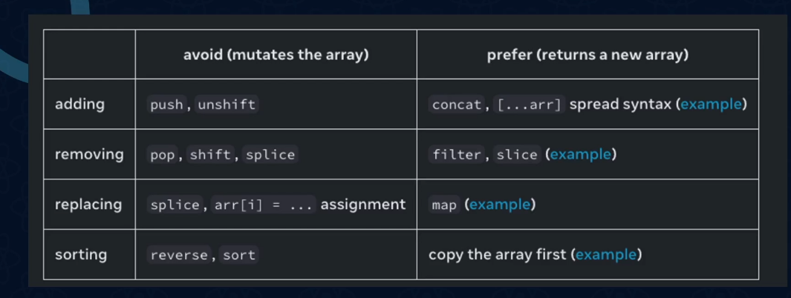

# cour 11 : **Array State:**

## 1. **Array State en React**

> En React, un **array state** est un état (`useState`) qui contient un **tableau**. Il est couramment utilisé pour stocker des **listes d'éléments dynamiques** comme une liste de tâches, des produits d'un panier, etc.

-   **Déclaration et Syntaxe de l'Array State**

    On utilise `useState` pour gérer un tableau comme état :

    ```jsx
    const [items, setItems] = useState([]); // Tableau vide au départ
    ```

    -   `items` : représente le tableau d’éléments.
    -   `setItems` : permet de mettre à jour l’état (`items`).
    -   Initialement, `items` est un tableau vide `[]`.

## 2.**Opérations courantes sur un Array State :**

-   **Ajouter un élément :**

    ```jsx
    const addItem = (newItem) => {
    	setItems([...items, newItem]); // Ajoute l'élément à la fin
    };
    ```

-   **Supprimer un élément (`filter`)**

    ```jsx
    const removeItem = (id) => {
    	setItems(items.filter((item) => item.id !== id));
    };
    ```

-   **Modifier un élément (`map`)**

    ```jsx
    const editItem = (id, newName) => {
    	setItems(
    		items.map((item) =>
    			item.id === id ? { ...item, name: newName } : item
    		)
    	);
    };
    ```

## 3. **Exemple Complet : Gestion d’une Liste d’Articles**

```jsx
import { useState } from "react";

const App = () => {
	const [items, setItems] = useState([]);

	const addItem = (name) => {
		const newItem = { id: Date.now(), name, packed: false };
		setItems([...items, newItem]);
	};

	const removeItem = (id) => {
		setItems(items.filter((item) => item.id !== id));
	};

	const togglePacked = (id) => {
		setItems(
			items.map((item) =>
				item.id === id ? { ...item, packed: !item.packed } : item
			)
		);
	};

	return (
		<div>
			<button onClick={() => addItem("Article " + (items.length + 1))}>
				Ajouter un article
			</button>
			<ul>
				{items.map((item) => (
					<li key={item.id}>
						{item.name} - {item.packed ? "✔️" : "❌"}
						<button onClick={() => togglePacked(item.id)}>
							Toggle
						</button>
						<button onClick={() => removeItem(item.id)}>
							Supprimer
						</button>
					</li>
				))}
			</ul>
		</div>
	);
};

export default App;
```

### Rq : 📌 **Récapitulatif des Bonnes Pratiques** ✅

1. **Toujours créer un nouveau tableau** (`spread operator`, `map`, `filter`).
2. **Ne pas modifier directement le state** (`state.push()` ❌, utiliser `setItems([...state])` ✅).
3. **Utiliser `id` pour identifier chaque élément** (évite les conflits).
4. **Optimiser la gestion de l’état** en groupant les mises à jour si nécessaire.

### RQ :


