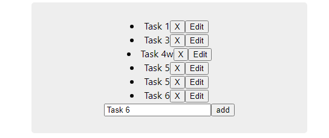

# cour 11 : **Array State:**

## 1. Description

> En React, vous pouvez utiliser le hook `useState` pour gérer l'état d'un composant fonctionnel, y compris un état qui est une liste (ou un tableau). Voici une description et un exemple détaillé de l'utilisation de `useState` avec une liste.

Le hook `useState` permet de déclarer une variable d'état dans un composant fonctionnel. Lorsque cette variable change, le composant se re-render pour refléter les nouvelles valeurs.

## 2. **Syntaxe:**

```javascript
const [state, setState] = useState([val1, val2]);
```

-   `state` : la variable d'état actuelle.
-   `setState` : une fonction qui met à jour l'état.
-   `initialState` : la valeur initiale de l'état, qui peut être une liste ou un autre type de données.

## 3. **Exemple:`TodoList`**

```jsx
import { useState } from "react";
import "./Task.css";

function TodoList() {
    let count = 4;
    const [value, setValue] = useState("");
    const [devaices, setDevaices] = useState([
        { id: 1, name: "task 1" },
        { id: 2, name: "task 2" },
        { id: 3, name: "task 3" },
        { id: 4, name: "task 4 " },
    ]);

    function handelAdd() {
        count++;
        setDevaices([...devaices, { id: count, name: value }]);
    }

    function handelDelete(id) {
        setDevaices(devaices.filter((elem) => (elem.id !== id ? true : false)));
    }

    function handelEdit(id) {
        setDevaices(
            devaices.map((elem) => {
                if (elem.id === id) {
                    elem.name = elem.name + "w";
                    return elem;
                }

                return elem;
            })
        );
    }

    const devaicesList = devaices.map((item) => (
        <li key={item.id}>
            {item.name}
            <button onClick={() => handelDelete(item.id)}>X</button>
            <button onClick={() => handelEdit(item.id)}>Edit</button>
        </li>
    ));

    return (
        <>
            <div className="task">
                {devaicesList}
                <input
                    type="text"
                    value={value}
                    onChange={(e) => setValue(e.target.value)}
                />
                <button onClick={handelAdd}>add</button>
            </div>
        </>
    );
}

export default Task;
```



### RQ :


