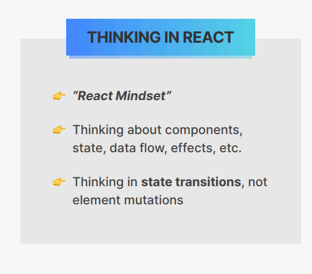
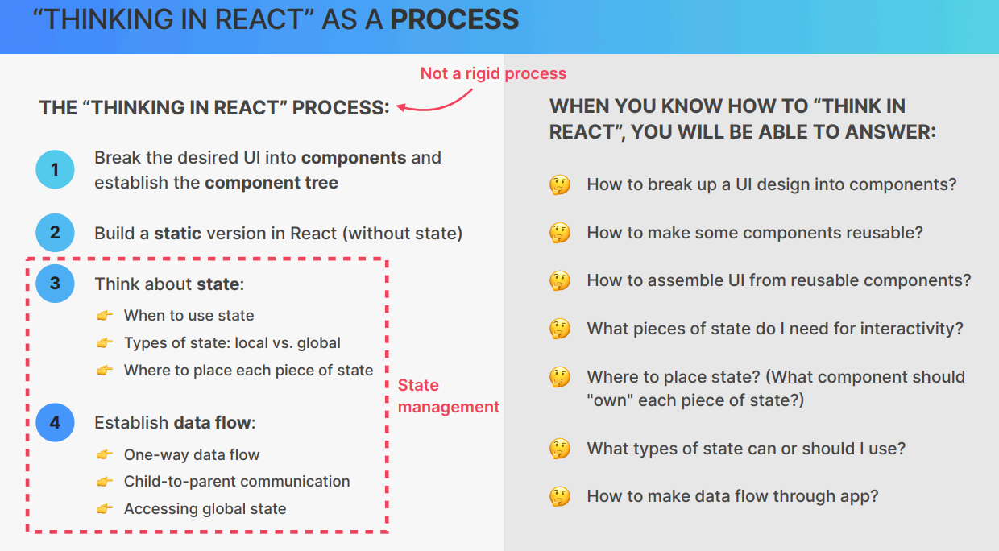
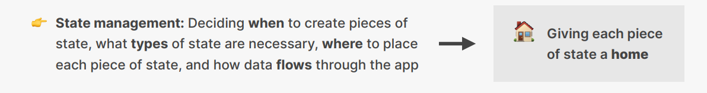
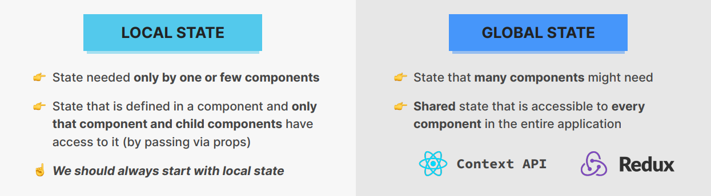
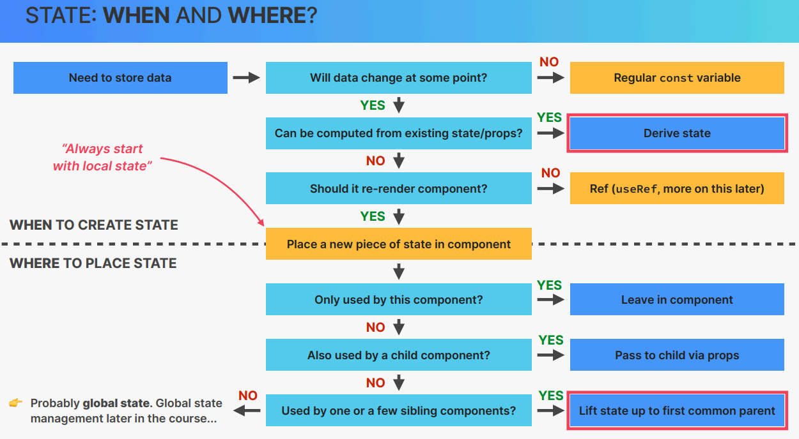

# Cour : **`THINKING IN REACT`**

## 1. **Définition:**

> **Thinking in React** est une approche de développement proposée par Facebook pour structurer et concevoir des applications React de manière efficace.

-   Elle repose sur cinq étapes clés :

    1. **Diviser l'interface utilisateur en composants** : Identifier les différentes parties de l'UI et les transformer en composants réutilisables.
    2. **Construire une hiérarchie de composants** : Organiser les composants de manière modulaire et imbriquée en suivant une structure logique.
    3. **Définir l’état minimal nécessaire** : Identifier quelles données doivent être stockées dans l’état local et lesquelles peuvent être dérivées des props.
    4. **Déterminer où stocker l’état** : Placer l’état au niveau du composant le plus haut nécessaire pour éviter la duplication et faciliter la gestion.
    5. **Ajouter des flux de données unidirectionnels** : Les données circulent de haut en bas (parent → enfant) via les props, garantissant une mise à jour prévisible de l'interface.

## 2. **State Management:**

> Le **State Management** en React désigne la gestion de l’état de l’application, c’est-à-dire la manière dont les données sont stockées, mises à jour et partagées entre les composants.

-   📌 **Concept clé**

    > Dans React, l’état représente les données dynamiques qui influencent le rendu d’un composant. Une bonne gestion de l’état garantit une application fluide et prévisible.

-   **Types de gestion de l’état en React**

    -   **State local (useState, useReducer)**

        -   Géré directement dans un composant avec `useState` ou `useReducer`.
        -   Idéal pour des données qui concernent un seul composant (ex. formulaire, modale).

    -   **State global (Context API, Redux, Zustand, Jotai, Recoil...)**

        -   Utilisé pour partager l’état entre plusieurs composants.
        -   Exemple : un panier d’achats dans une boutique en ligne.

    -   **State du serveur (React Query, SWR...)**

        -   Données récupérées depuis une API et stockées pour éviter des requêtes inutiles.
        -   Exemple : chargement de données utilisateur.

    -   **State de l’URL (useLocation, useParams, query strings...)**
        -   Informations stockées dans l’URL (ex. ID d’un article dans l’URL d’une page produit).

