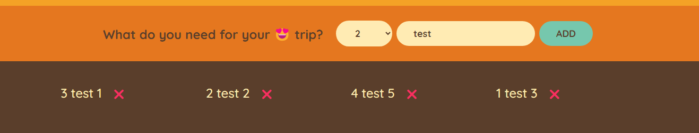
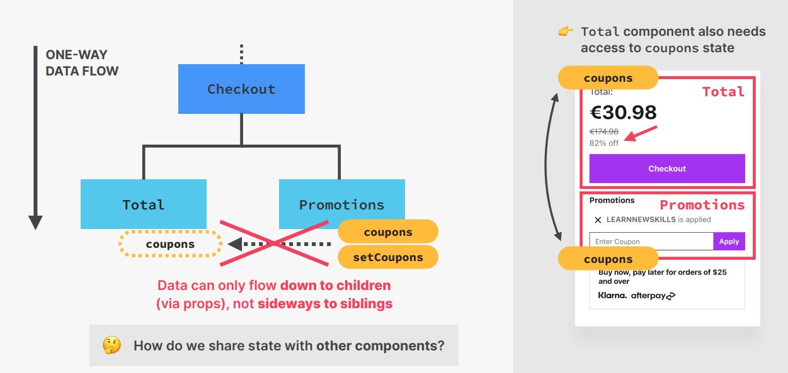
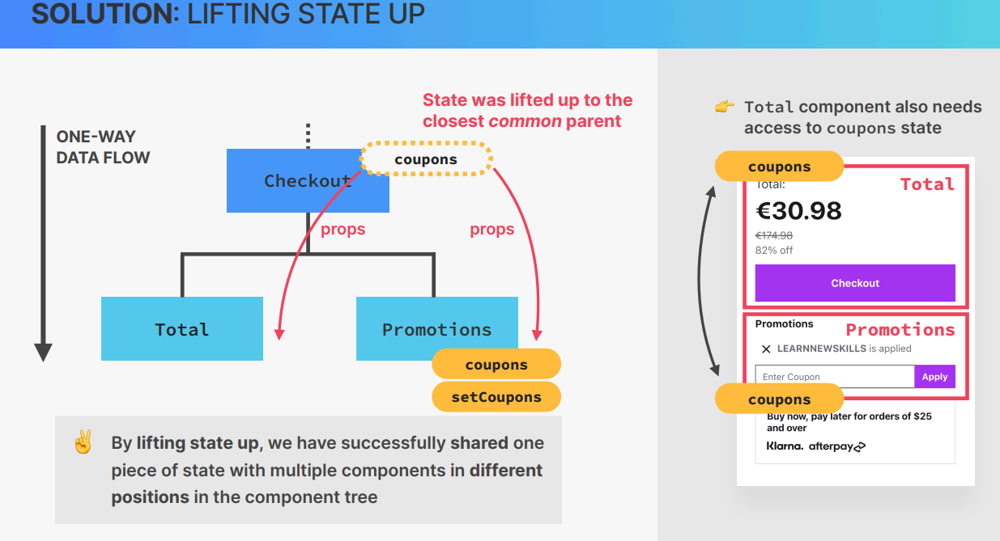
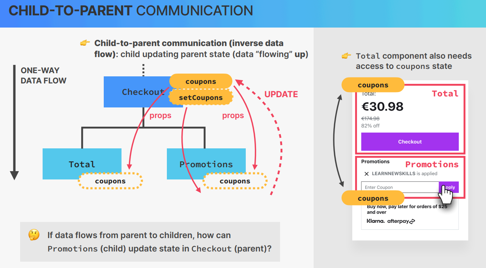

# Cour : 🎯 **Pattern "Lifting State Up" en React**

## 1️.**Définition et Utilisation**

-   **Définition**

    > **"Lifting State Up"** (ou **remontée de l’état**) est un pattern React où l'état d'un composant enfant est **déplacé vers un composant parent** pour le partager avec plusieurs enfants.

-   Dans React, les données **circulent toujours de haut en bas** (des parents vers les enfants via les props). Ce pattern permet donc de **centraliser l’état dans un composant parent** pour que plusieurs composants enfants puissent y accéder et le modifier.

-   🛠 **Quand utiliser "Lifting State Up" ?**

    1. **Plusieurs composants doivent partager un même état**  
       → Exemple : un groupe de boutons où un seul peut être actif à la fois.
    2. **Un composant doit influencer un autre**  
       → Exemple : une liste où cliquer sur un élément met à jour un détail affiché ailleurs.
    3. **Gérer les inputs d’un formulaire**  
       → Exemple : synchroniser plusieurs champs d'un formulaire avec un état unique.

## 2️.**implémentation :**

### 2.1 **Syncronisation des `Items`:**

> **Objectif** : Une seule carte doit afficher sa réponse à la fois.

-   **Étape 1 : Composant Parent qui gère l’état**

    ```jsx
    import React, { useState } from "react";
    import Card from "./Card";

    export default function FlashcardList({ cards }) {
    	const [selectedCardId, setSelectedCardId] = useState(null);

    	const handleCardClick = (id) => {
    		setSelectedCardId((prevId) => (prevId === id ? null : id)); // Active/désactive la carte
    	};

    	return (
    		<div>
    			{cards.map((card) => (
    				<Card
    					key={card.id}
    					question={card}
    					isSelected={selectedCardId === card.id}
    					onClick={() => handleCardClick(card.id)}
    				/>
    			))}
    		</div>
    	);
    }
    ```

    ✔️ Ici, `FlashcardList` stocke **l’ID de la carte sélectionnée** et met à jour l’état quand on clique.

-   **Étape 2 : Composant Enfant qui affiche question/réponse**

    ```jsx
    import React from "react";

    export default function Card({ question, isSelected, onClick }) {
    	return (
    		<div onClick={onClick} className={isSelected ? "selected" : ""}>
    			<p>{isSelected ? question.answer : question.question}</p>
    		</div>
    	);
    }
    ```

    ✔️ `Card` **ne stocke pas son propre état**, il dépend uniquement des props (`isSelected` et `onClick`).

-   **Étape 3 : Passer des données au composant parent**

    Tu peux tester avec ces données dans ton `App.js` :

    ```jsx
    const cards = [
    	{ id: 1, question: "Capitale de la France ?", answer: "Paris" },
    	{ id: 2, question: "3 × 3 ?", answer: "9" },
    	{
    		id: 3,
    		question: "Auteur du 'Petit Prince' ?",
    		answer: "Antoine de Saint-Exupéry",
    	},
    ];

    <FlashcardList cards={cards} />;
    ```

### 2.2 .**Display `items` && get `item`:**

-   **`PackingList.jsx:`**

    ```jsx
    import React from "react";
    import Item from "./Item";

    export default function PackingList({ items }) {
    	return (
    		<div className="list">
    			<ul>
    				{items.map((item) => (
    					<Item key={item.id} item={item} />
    				))}
    			</ul>
    		</div>
    	);
    }
    ```

-   **`Form.jsx:`**

    ```jsx
    import React, { useState } from "react";

    export default function Form({ onAddItems }) {
    	const [description, setDescription] = useState("");
    	const [quantity, setQuantity] = useState(1);

    	const handleSubmit = (e) => {
    		e.preventDefault();

    		if (!description) return;

    		const item = {
    			description,
    			quantity,
    			packed: false,
    			id: Date.now(),
    		};

    		onAddItems(item);

    		setDescription("");
    		setQuantity(1);
    	};

    	return (
    		<form className="add-form" onSubmit={handleSubmit}>
    			<h3>What do you need for your 😍 trip?</h3>
    			<select
    				value={quantity}
    				onChange={(e) => setQuantity(+e.target.value)}
    			>
    				{[...Array(20)].map((_, i) => (
    					<option key={i + 1} value={i + 1}>
    						{i + 1}
    					</option>
    				))}
    			</select>
    			<input
    				type="text"
    				placeholder="Item..."
    				value={description}
    				onChange={(e) => {
    					setDescription(e.target.value);
    				}}
    			/>
    			<button>Add</button>
    		</form>
    	);
    }
    ```

-   **`App.jsx:`**

    ```jsx
    function App() {
    	const [items, setItems] = useState([]);

    	const handelAddItems = (item) => {
    		setItems((items) => [...items, item]);
    	};

    	return (
    		<div className="app">
    			<Logo />
    			<Form onAddItems={handelAddItems} />
    			<PackingList items={items} />
    			<Stats />
    		</div>
    	);
    }
    ```



### Rq : 🎯 **Résumé du Pattern `Lifting State Up`:**

| Avantages                                     | Inconvénients                                                |
| --------------------------------------------- | ------------------------------------------------------------ |
| ✅ Centralise l'état                          | ❌ Peut complexifier la structure si trop d'état est remonté |
| ✅ Facilite la communication entre composants | ❌ Peut nécessiter de prop-driller (passer trop de props)    |
| ✅ Évite des états locaux dupliqués           |                                                              |

-   **Alternatives si le projet devient complexe**

    -   **Context API** : Pour éviter de devoir passer des props à trop de composants.
    -   **Redux / Zustand** : Si l’état est global et partagé par toute l’application.
    -   **Recoil** : Pour une gestion d’état plus fine avec des "atoms" (petits états indépendants).

### **Exemple `checkout`:**

-   **étape 1:**

    

-   **étape 2:**

    

-   **étape 3:**

    
