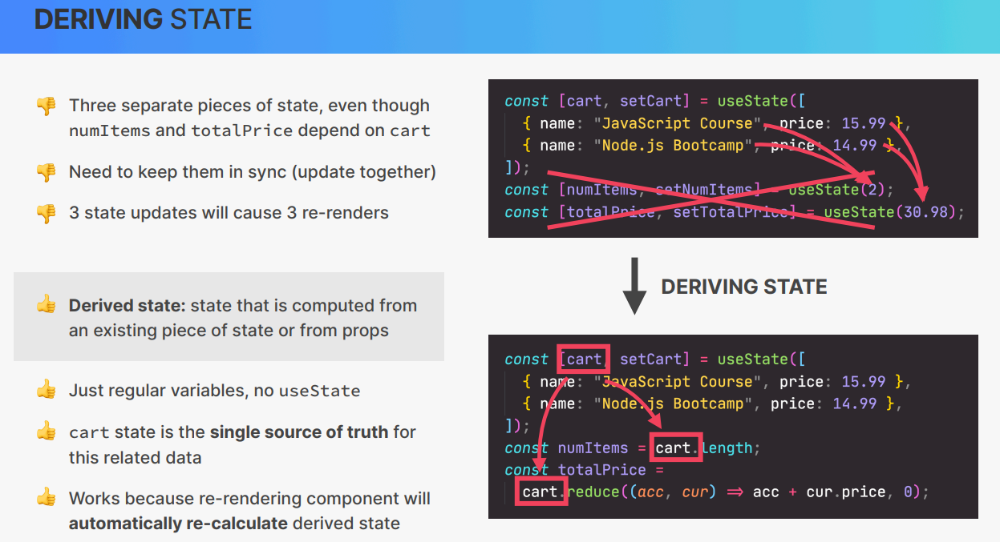

# Cour : 📌 **Derived State (État Dérivé) en React**

## 1. **Définition:**

> En React, un **état dérivé** (**Derived State**) est une valeur calculée à partir de l’état existant.

-   **⚠️ Mauvaise pratique** : Stocker des valeurs dérivables directement dans le `useState`.
-   👉 **Bonne pratique** : Les calculer **à la volée** dans le rendu (`useMemo`) ou avec des variables locales.

-   **Pourquoi éviter de stocker un état dérivé dans `useState` ?**

    -   **Mise à jour inutile** : Si un état est **calculable à partir d’un autre**, il n’est pas nécessaire de le stocker.
    -   **Meilleure optimisation** : React peut éviter des re-rendus inutiles.

-   Exemple **❌ Mauvaise approche** :

    ```jsx
    const [items, setItems] = useState([
    	{ id: 1, name: "Chaussures", packed: false },
    	{ id: 2, name: "Sac", packed: true },
    ]);
    const [packedCount, setPackedCount] = useState(0); // ❌ Mauvais, car on peut le dériver

    useEffect(() => {
    	setPackedCount(items.filter((item) => item.packed).length); // ❌ Mauvais
    }, [items]);
    ```

    ⚠️ Ici, `packedCount` est dérivable → inutile de le stocker !

## 2. **Solution : Utiliser des valeurs dérivées directement dans le rendu**

-   👉 **Bonne pratique** : Ne pas stocker `packedCount`, mais le calculer dynamiquement.

-   ✅ **Exemple correct**

    ```jsx
    const packedCount = items.filter((item) => item.packed).length;
    ```

    🔹 **Avantages :**

    -   Pas de **surcharge** avec un `useState` inutile.
    -   Mise à jour **automatique** dès que `items` change.

## 🎯 **Récapitulatif**

| ❌ Mauvaise Approche                             | ✅ Bonne Approche                                        |
| ------------------------------------------------ | -------------------------------------------------------- |
| Stocker un état dérivé dans `useState`           | Le recalculer à la volée (`filter`, `map`, `reduce`)     |
| Mettre à jour l’état dérivé avec `useEffect`     | Utiliser `useMemo` si l’opération est coûteuse           |
| Modifier directement un tableau (`sort`, `push`) | Créer une nouvelle copie (`[...items]`, `map`, `filter`) |


