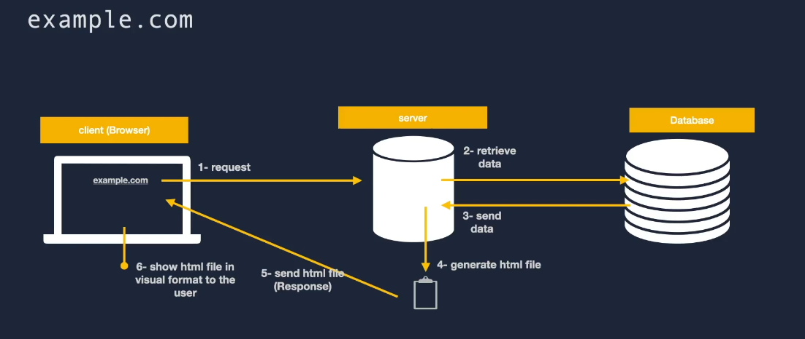
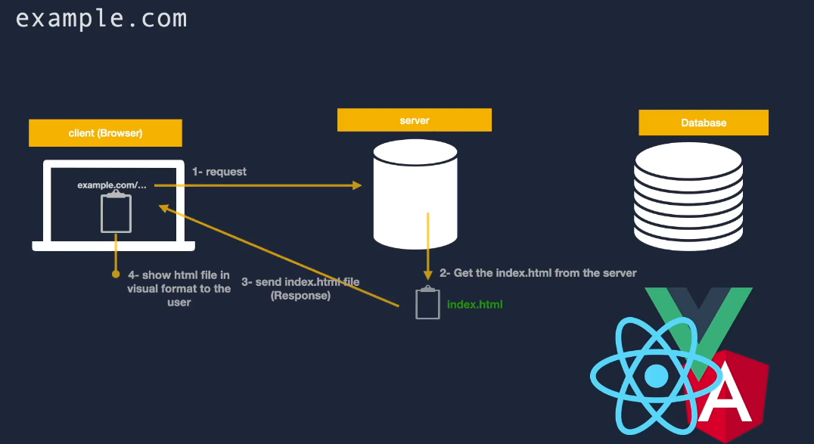
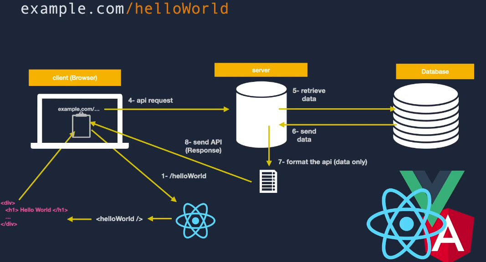

# cour 18 : **`SSR` , `CSR` et `SPA` :**

## 1. **`SSR`: Server-Side Rendering**

-   **Description:**

    -   `SSR` : Technique de génération du contenu HTML d'une page web sur le serveur avant de l'envoyer au client (navigateur).

    > **Server-Side Rendering (SSR)** est une technique de rendu des pages web où le contenu HTML est généré sur le serveur plutôt que sur le client. Contrairement au Client-Side Rendering (CSR), où le navigateur exécute JavaScript pour construire le contenu de la page après le chargement initial, le SSR envoie directement le HTML complet au navigateur. Cela peut améliorer les performances, la SEO (Search Engine Optimization) et l'expérience utilisateur, notamment en réduisant le temps de chargement perçu.

-   **Étapes de Communication:**

    Le processus de SSR peut être décomposé en plusieurs étapes :

    1. **Requête du Client** :

        - L'utilisateur demande une page web en entrant une URL ou en cliquant sur un lien.
        - Le navigateur envoie `une requête HTTP` au serveur.

    2. **Traitement sur le Serveur** :

        - Le serveur reçoit la requête et traite la demande.
        - Le serveur exécute le code de l'application, souvent en utilisant un framework comme Next.js (pour React) ou Nuxt.js (pour Vue.js).
        - Le serveur récupère les données nécessaires (par exemple, à partir d'une base de données ou d'une API).

    3. **Génération du HTML** :

        - Le serveur utilise les données récupérées pour rendre le contenu HTML complet.
        - Le serveur injecte les données dynamiques dans les templates HTML.

    4. **Envoi de la Réponse** :

        - Le serveur envoie le HTML rendu au navigateur sous forme de `réponse HTTP`.
        - Le navigateur reçoit le HTML et commence à afficher le contenu.

    5. **Hydratation** :

        - Une fois le HTML rendu affiché, le navigateur télécharge et exécute les fichiers JavaScript associés.
        - Le framework (par exemple, React, Vue) "hydrate" le HTML, liant le contenu statique aux interactions dynamiques.
        - L'hydratation permet aux composants d'interagir avec le DOM comme s'ils avaient été rendus côté client.



-   **Avantages du SSR:**

    1. **Performance** :

        - Temps de chargement initial plus rapide car le HTML complet est envoyé au client.
        - Moins de temps d'attente pour que le contenu soit visible.

    2. **SEO** :

        - Les moteurs de recherche peuvent indexer le contenu plus facilement car ils reçoivent le HTML complet.

    3. **Accessibilité** :
        - Meilleure accessibilité pour les utilisateurs avec des connexions lentes ou des appareils moins puissants.

-   **Inconvénients du SSR:**

    1. **Charge du serveur** :

        - Le serveur doit rendre chaque page à chaque requête, ce qui peut augmenter la charge.

    2. **Complexité** :
        - Nécessite une gestion des données côté serveur et une coordination avec le client pour l'hydratation.

## 2. **`CSR` : Client-Side Rendering**

-   **Description:**

    -   `CSR`: Technique de génération du contenu HTML d'une page web côté client, en utilisant JavaScript pour récupérer les données et construire dynamiquement l'interface utilisateur.

    > Le **Client-Side Rendering** (CSR) est une technique de rendu des pages web où le contenu HTML est généré côté client, c'est-à-dire dans le navigateur, à l'aide de JavaScript. Contrairement au Server-Side Rendering (SSR), où le serveur génère le HTML complet et l'envoie au client, le CSR envoie généralement une page HTML minimale et utilise JavaScript pour récupérer et afficher dynamiquement le contenu.

-   **Étapes de Communication :**

    Le processus de Client-Side Rendering implique généralement plusieurs étapes de communication entre le client, le serveur et la base de données :

    1. **Requête Initiale du Client** :

        - L'utilisateur entre une URL ou clique sur un lien, déclenchant une requête HTTP vers le serveur.

    2. **Envoi de la Réponse Minimaliste** :

        - Le serveur renvoie une page HTML minimale, souvent appelée "squelette" ou "shell" de l'application.
        - Cette page contient généralement les balises HTML de base, les liens vers les fichiers JavaScript et les feuilles de style.

    3. **Chargement du Code JavaScript** :

        - Le navigateur charge les fichiers JavaScript associés à l'application.
        - Ces fichiers contiennent généralement le code pour récupérer les données, créer les composants et mettre à jour l'interface utilisateur.

    4. **Récupération des Données** :

        - Le code JavaScript exécuté côté client envoie des requêtes asynchrones (par exemple, des requêtes AJAX ou des appels à une API) pour récupérer les données nécessaires.
        - Ces données peuvent provenir d'une API REST, d'une base de données, ou d'autres sources de données distantes.

    5. **Construction de l'Interface Utilisateur** :

        - Une fois que les données sont récupérées, le code JavaScript construit dynamiquement l'interface utilisateur en utilisant des bibliothèques ou des frameworks front-end comme React, Vue.js, ou Angular.
        - Les données sont insérées dans les composants pour générer le contenu final.

    6. **Affichage du Contenu Dynamique** :
        - Le contenu dynamique est rendu dans le navigateur, permettant à l'utilisateur d'interagir avec l'application.





-   **Avantages du CSR:**

    1. **Interactivité** :

        - Offre une expérience utilisateur interactive avec des mises à jour dynamiques du contenu sans rechargement de la page.

    2. **Performances Perçues** :

        - Peut offrir une impression de rapidité car la page de base est affichée rapidement et le contenu est chargé dynamiquement.

    3. **Architecture Séparée** :
        - Permet de séparer l'API et la logique de rendu, offrant une architecture plus modulaire.

-   **Inconvénients du CSR:**

    1. **SEO** :

        - Les moteurs de recherche peuvent avoir des difficultés à indexer le contenu dynamique rendu côté client.

    2. **Accessibilité** :

        - Peut poser des problèmes d'accessibilité pour les utilisateurs ayant des technologies d'assistance ou des connexions lentes.

    3. **Dépendance au JavaScript** :
        - Nécessite que le navigateur supporte JavaScript pour afficher le contenu, ce qui peut poser des problèmes de compatibilité.

## 3. **`SPA`:**

-   **Description:**

    > Un Single Page Application (SPA) est un type d'application web où toute l'interface utilisateur est chargée une seule fois au début de la session de l'utilisateur, puis le contenu est mis à jour dynamiquement en réponse aux interactions de l'utilisateur, sans rechargement de page complet. Cela crée une expérience utilisateur fluide et réactive similaire à celle des applications natives.

    -   Dans un SPA, au lieu de naviguer entre différentes pages avec des rechargements complets, les transitions entre les différentes sections de l'application se font en chargent dynamiquement le contenu nécessaire et en mettant à jour l'URL dans le navigateur à l'aide de JavaScript. Les SPAs sont souvent construits en utilisant des frameworks ou des bibliothèques JavaScript comme React, Angular, ou Vue.js, qui facilitent la gestion de l'état de l'application et la manipulation du DOM.

-   **Réalisation avec React Router:**

    React Router est une bibliothèque populaire pour la gestion de la navigation dans les applications React, et elle est couramment utilisée pour construire des SPAs. Voici comment React Router aide à réaliser les concepts clés d'un SPA :

    1. **Gestion de la Navigation** :

        - React Router permet de définir des routes pour différentes sections de l'application en associant des URL à des composants spécifiques.

    2. **Rendu Dynamique** :

        - Lorsqu'un utilisateur navigue vers une nouvelle URL, React Router rend dynamiquement le composant associé à cette URL, sans recharger la page entière.

    3. **Mise à Jour de l'URL** :

        - React Router met à jour l'URL dans le navigateur en fonction de la navigation de l'utilisateur, ce qui permet de conserver l'état de l'application et de permettre le partage des liens.

    4. **Gestion de l'État** :
        - React Router permet également de gérer l'état de l'application en utilisant des paramètres d'URL, des paramètres de requête, ou des états internes dans les composants.

-   **Exemple d'utilisation de React Router dans un SPA:**

    Voici un exemple simple de la façon dont React Router peut être utilisé pour construire un SPA :

    ```jsx
    import React from "react";
    import { BrowserRouter as Router, Routes, Route } from "react-router-dom";
    import Home from "./components/Home";
    import About from "./components/About";
    import Contact from "./components/Contact";

    const App = () => {
        return (
            <Router>
                <Routes>
                    <Route path="/" element={<Home />} />
                    <Route path="/about" element={<About />} />
                    <Route path="/contact" element={<Contact />} />
                </Routes>
            </Router>
        );
    };

    export default App;
    ```
