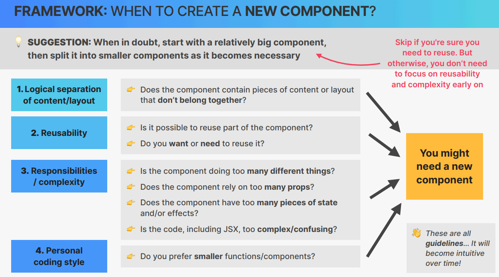

# Cour : 🎨 **How to Split UI in React?**

> Quand on développe une application React, il est essentiel de **bien structurer l'interface utilisateur** en composants réutilisables. Une bonne séparation des composants améliore la **lisibilité**, la **maintenabilité** et la **performance** du code.

## 1.**Commencer par une Approche Haut-Niveau**

-   Avant d’écrire du code, **analysons l’UI** en identifiant les **différentes sections** qui la composent.

-   Chaque composant doit avoir **une seule responsabilité claire** (`Single Responsibility Principle`).

-   **Exemple : Une Application de Tâches (Todo App)**

    Imaginons une interface avec :  
     ✅ Un champ d’entrée pour ajouter une tâche.  
     ✅ Une liste de tâches affichées.  
     ✅ Chaque tâche avec un bouton de suppression.

    ```
    <App>
    ├── <Header />        (Titre de l’application)
    ├── <TodoInput />     (Champ pour ajouter une tâche)
    ├── <TodoList />      (Affiche la liste des tâches)
    │    ├── <TodoItem /> (Chaque tâche individuelle)
    ```

## 2.**Identifier les Composants en Fonction du Contenu**

-   **Pose-toi les questions suivantes :**

    -   **Les éléments partagent-ils une logique commune ?**
    -   **Sont-ils réutilisables ailleurs ?**
    -   **Le composant devient-il trop grand et difficile à lire ?**

    > Si la réponse est `oui`, il faut **diviser** en sous-composants.

## 3.**Décomposer en Composants Réutilisables**

-   Les composants React sont souvent classés en deux types :

    -   **Composants Présentatifs (UI Components)**

        -   Ils affichent les données mais ne les manipulent pas.
        -   Exemples : `Button`, `Card`, `ListItem`.

    -   **Composants Logiques (Container Components)**

        -   Ils gèrent l’état et la logique métier.
        -   Exemples : `TodoListContainer`, `AuthProvider`.

## 4. **Approche générale :`FRAMEWORK: WHEN TO CREATE A NEW COMPONENT?`**

> **Commencez avec un grand composant**, puis divisez-le en plusieurs composants si nécessaire.
> **Ne vous concentrez pas trop sur la réutilisabilité et la complexité dès le départ**.

-   **Critères pour créer un nouveau composant :**

1. **Séparation logique du contenu et de la mise en page**

    - Si le composant contient des parties qui **ne vont pas ensemble**, il faut les séparer.

2. **Réutilisabilité**

    - Est-il possible de réutiliser une partie du composant ?
    - **Avez-vous besoin** de le réutiliser ?

3. **Responsabilités et complexité**

    - Fait-il trop de choses différentes ?
    - Utilise-t-il trop de props ?
    - Gère-t-il trop d’état ou d’effets ?
    - Son code devient-il difficile à comprendre ?

4. **Style de codage personnel**
    - Préférez-vous des **fonctions et composants plus petits** ?



## 5.**Exemple de Découpage en React**

-   **App.jsx:**

    ```jsx
    // App.js (Composant principal)
    import React, { useState } from "react";
    import TodoInput from "./TodoInput";
    import TodoList from "./TodoList";

    function App() {
    	const [todos, setTodos] = useState([]);

    	const addTodo = (text) => {
    		setTodos([...todos, { id: Date.now(), text }]);
    	};

    	return (
    		<div>
    			<h1>Todo App</h1>
    			<TodoInput onAdd={addTodo} />
    			<TodoList todos={todos} />
    		</div>
    	);
    }

    export default App;
    ```

-   **TodoInput.jsx:**

    ```jsx
    import React, { useState } from "react";

    function TodoInput({ onAdd }) {
    	const [text, setText] = useState("");

    	const handleAdd = () => {
    		if (text.trim()) {
    			onAdd(text);
    			setText("");
    		}
    	};

    	return (
    		<div>
    			<input value={text} onChange={(e) => setText(e.target.value)} />
    			<button onClick={handleAdd}>Add</button>
    		</div>
    	);
    }

    export default TodoInput;
    ```

-   **TodoList.jsx:**

    ```jsx
    import React from "react";
    import TodoItem from "./TodoItem";

    function TodoList({ todos }) {
    	return (
    		<ul>
    			{todos.map((todo) => (
    				<TodoItem key={todo.id} text={todo.text} />
    			))}
    		</ul>
    	);
    }

    export default TodoList;
    ```

-   **TodoItem.jsx:**

    ```jsx
    import React from "react";

    function TodoItem({ text }) {
    	return <li>{text}</li>;
    }

    export default TodoItem;
    ```

### RQ :

-   **Règles Clés pour un Bon Découpage**

✅ **Ne pas trop anticiper la réutilisabilité** → Pas besoin de créer un composant si on ne le réutilise pas encore.  
✅ **Éviter les composants trop gros** → S’ils deviennent compliqués, diviser en sous-composants.  
✅ **Ne pas rendre chaque petite partie un composant** → Il faut un équilibre.  
✅ **Utiliser des composants logiques et présentatifs** → Une bonne séparation améliore la lisibilité.
