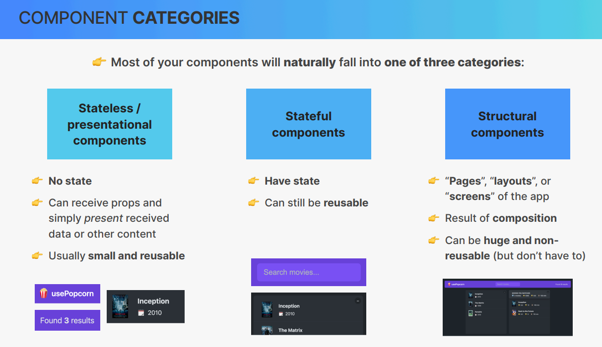

# Cour : **Les catégories de composants en React**

> Dans le développement d'interfaces avec React, les composants peuvent être classés en trois grandes catégories :

-   **Composants stateless (présentationnels)**
-   **Composants stateful**
-   **Composants structurels**

## 1.**Composants Stateless / Présentationnels**

-   **Définition**

    > Les composants stateless sont des composants qui **n'ont pas d'état interne**. Ils reçoivent des **props** et se contentent d’afficher des données sans les modifier.

-   **Cas d'utilisation**

    -   Affichage de texte ou d’éléments graphiques.
    -   Création d’éléments UI réutilisables comme des boutons ou des cartes d’information.
    -   Formatage et mise en page des données reçues via des props.

-   **Exemple**

    ```jsx
    const MovieCard = ({ title, year }) => {
    	return (
    		<div className="movie-card">
    			<h3>{title}</h3>
    			<p>{year}</p>
    		</div>
    	);
    };

    // Utilisation
    <MovieCard title="Inception" year={2010} />;
    ```

## 2.**Composants Stateful**

-   **Définition**

    > Les composants stateful gèrent un **état interne**. Ils peuvent réagir aux interactions de l'utilisateur, modifier leurs données et mettre à jour l'affichage dynamiquement.

-   **Cas d'utilisation**

    -   Champs de recherche avec filtrage dynamique.
    -   Gestion des interactions utilisateur comme les boutons "like" ou "favoris".
    -   Stockage temporaire de données, comme une liste d’éléments sélectionnés.

-   **Exemple**

    ```jsx
    import { useState } from "react";

    const SearchBar = () => {
    	const [query, setQuery] = useState("");

    	return (
    		<input
    			type="text"
    			value={query}
    			onChange={(e) => setQuery(e.target.value)}
    			placeholder="Search movies..."
    		/>
    	);
    };
    ```

## 3.**Composants Structurels**

-   **Définition**

    > Les composants structurels sont utilisés pour organiser l’interface en **pages, layouts ou écrans complets**. Ils sont souvent composés de plusieurs composants stateless et stateful.

-   **Cas d'utilisation**

    -   Création de pages ou de sections complètes d'une application.
    -   Organisation des composants pour former une mise en page cohérente.
    -   Intégration et structuration de plusieurs composants dans une vue unique.

-   **Exemple :**

    ```jsx
    const MoviePage = () => {
    	return (
    		<div className="movie-page">
    			<Header />
    			<SearchBar />
    			<MovieList />
    		</div>
    	);
    };
    ```


