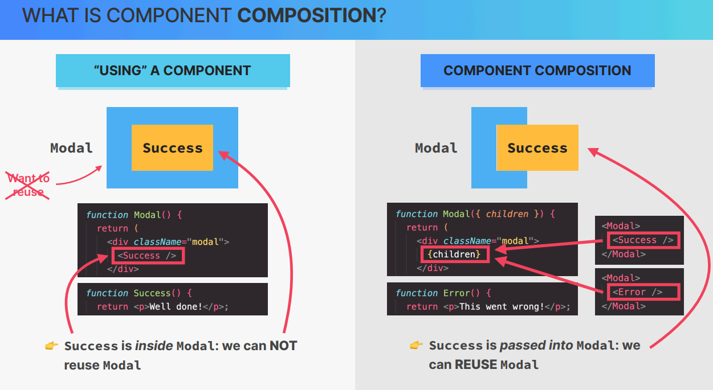
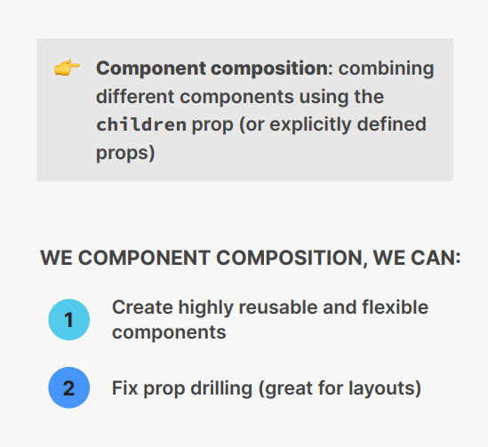

# Cour : **Cours sur la Composition de Composants en React**

## 1.**Définition et Utilisation**

-   **Définition :**

    > La **composition de composants** en React est une technique qui consiste à **imbriquer** des composants les uns dans les autres afin de créer des interfaces modulaires et réutilisables. Cela permet d’éviter la duplication de code et de faciliter la gestion des composants.

-   **Pourquoi utiliser la composition de composants ?**

    ✅ Réutilisabilité : permet d’utiliser des composants dans plusieurs parties de l’application.

    ✅ Séparation des préoccupations : chaque composant a une responsabilité bien définie.

    ✅ Facilité de maintenance : modification d’un seul composant sans impacter les autres.

    ✅ Meilleure lisibilité du code : structure claire et bien organisée.

-   **Cas d’utilisation**

    -   Créer des **layouts** en assemblant des composants de plus bas niveau.
    -   Concevoir des **modales génériques** qui affichent différents types de contenu (succès, erreur, confirmation, etc.).
    -   Construire des **formulaires dynamiques** en réutilisant des champs de saisie.



## 2.**Exemple : Composition avec une modale (Succès & Erreur)**

> Nous allons créer un composant **Modal** générique et l’utiliser pour afficher **un message de succès** et **un message d’erreur**.

-   **`Modal`**

    ```jsx
    const Modal = ({ title, children, onClose }) => {
    	return (
    		<div className="modal-overlay">
    			<div className="modal">
    				<h2>{title}</h2>
    				<div className="modal-content">{children}</div>
    				<button onClick={onClose}>Fermer</button>
    			</div>
    		</div>
    	);
    };
    ```

-   **Utilisation pour un message de succès**

    ```jsx
    const SuccessModal = ({ onClose }) => {
    	return (
    		<Modal title="Succès !" onClose={onClose}>
    			<p>Votre action a été réalisée avec succès ✅</p>
    		</Modal>
    	);
    };
    ```

-   **Utilisation pour un message d’erreur**

    ```jsx
    const ErrorModal = ({ onClose }) => {
    	return (
    		<Modal title="Erreur ❌" onClose={onClose}>
    			<p>Une erreur est survenue. Veuillez réessayer.</p>
    		</Modal>
    	);
    };
    ```

### RQ :

-   ✅ **La composition de composants évite les props inutiles comme `dirilign` en laissant le parent gérer l'affichage via `children`, rendant les composants plus flexibles et maintenables.**


