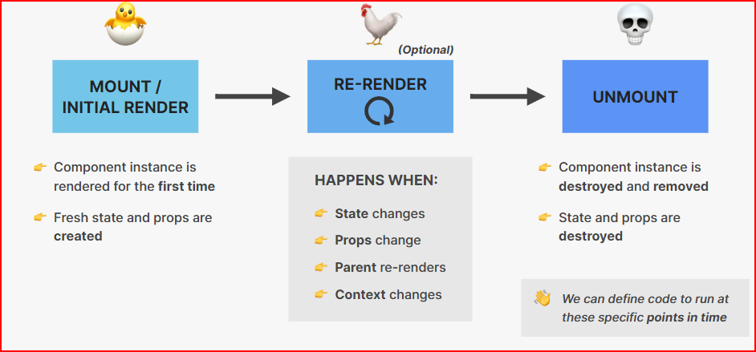

# Cour 23 :

## 1. **Qu’est-ce que le Lifecycle d’un composant React ?**

-   Le _lifecycle_ (cycle de vie) d’un composant React représente les **différentes phases** par lesquelles passe un composant depuis sa création jusqu’à sa suppression. Il y a **trois grandes phases** :

    1. **Mounting** (Montage)
    2. **Updating** (Mise à jour)
    3. **Unmounting** (Démontage)



## 2. **Cycle de vie d’un composant `fonctionnel`:**

> Dans un composant fonctionnel, on n’a pas de méthodes comme `componentDidMount`, `componentDidUpdate` ou `componentWillUnmount`. **Tout se fait avec `useEffect` !**

-   **Syntaxe générale de `useEffect`:**

    ```js
    useEffect(() => {
    	// Code exécuté après le rendu

    	return () => {
    		// Code de cleanup exécuté avant le démontage ou avant le prochain effet
    	};
    }, [dépendances]);
    ```

-   **Comportement selon les dépendances:**

| Cas                       | Code                                       | Équivaut à...                            |
| ------------------------- | ------------------------------------------ | ---------------------------------------- |
| **Montage seulement**     | `useEffect(() => { ... }, [])`             | `componentDidMount`                      |
| **Montage + mise à jour** | `useEffect(() => { ... }, [val])`          | `componentDidMount + componentDidUpdate` |
| **Démontage**             | `return () => { ... }` dans un `useEffect` | `componentWillUnmount`                   |

-   **Exemples pratiques:**

    ```jsx
    useEffect(() => {
    	const interval = setInterval(() => {
    		console.log("tic");
    	}, 1000);

    	return () => {
    		clearInterval(interval);
    		console.log("Composant démonté !");
    	};
    }, []);
    ```

-   **Résumé du cycle (composants fonctionnels):**

    1. **Rendu initial** ➜ exécution de `useEffect` (si pas de dépendances ou dépendances initialisées)
    2. **Mise à jour** ➜ `useEffect` s'exécute à nouveau _si une dépendance change_
    3. **Démontage** ➜ fonction de cleanup exécutée automatiquement
