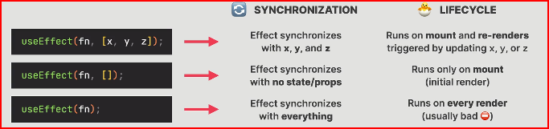

# Cour 24 : **useEffect**

## 1. **SideEffect:**

-   **Qu'est-ce qu'un Side Effect ?**

    > Un **side effect** (effet secondaire) est tout **code qui interagit avec le monde extérieur** à un composant React, en dehors de la logique de rendu.

-   **Exemples :**

    -   Appels API (data fetching)
    -   Manipulation du DOM
    -   Timers (`setTimeout`, `setInterval`)
    -   Subscriptions (WebSocket, event listeners)

-   **Quand les side effects sont déclenchés ?**

    Ils peuvent être déclenchés par :

    -   Des **événements utilisateurs** (`onClick`, `onSubmit`, etc.)
    -   Le **cycle de vie du composant** : **montage**, **mise à jour**, **démontage**

### RQ **Important : Pas de Side Effect dans la Render Logic**

Un **side effect ne doit jamais être exécuté pendant le rendu** d’un composant.

> 💡 Pourquoi ? Parce que le **rendu React doit rester pur** :
>
> -   Il doit **juste décrire l’UI** en fonction des props et du state.
> -   Il **ne doit pas déclencher d’action** (comme une requête API, une modification du DOM, etc.)

-   ⛔ Mauvais exemple (effet dans le render) :

    ```jsx
    function MyComponent() {
    	fetch("/api/data"); // ❌ Mauvais : appelé à chaque rendu !
    	return <div>Hello</div>;
    }
    ```

-   Bon exemple (effet dans `useEffect`) :

    ```jsx
    function MyComponent() {
    	useEffect(() => {
    		fetch("/api/data"); // ✅ Exécuté après le rendu
    	}, []);

    	return <div>Hello</div>;
    }
    ```

## 2. **useEffect:**

-   **Description:**

    > `useEffect` est un hook de React qui permet d'exécuter des effets secondaires dans les composants fonctionnels. Les effets secondaires peuvent inclure des opérations comme la récupération de données, la manipulation directe du DOM, ou l'abonnement à des flux de données.

    -   `useEffect` est utilisé pour synchroniser un composant avec des sources de données externes. Il est appelé après chaque rendu du composant, par défaut.

    -   Les effets peuvent être configurés pour s'exécuter à différents moments :

        -   **Après chaque rendu** : par défaut, l'effet s'exécute après chaque rendu du composant.
        -   **Une seule fois** : en passant un tableau vide comme deuxième argument, l'effet s'exécute uniquement après le premier rendu.
        -   **Quand certaines dépendances changent** : en passant un tableau de dépendances, l'effet s'exécute après le premier rendu et chaque fois qu'une dépendance change.

-   **Syntaxe:**

    La syntaxe de `useEffect` est la suivante :

    ```javascript
    useEffect(() => {
    	// Code de l'effet
    	return () => {
    		// Code de nettoyage (optionnel)
    	};
    }, [dépendances]);
    ```

    -   **Effet** : la fonction principale contenant le code de l'effet.
    -   **Nettoyage** : la fonction de nettoyage qui est appelée avant de réexécuter l'effet ou lorsque le composant est démonté.
    -   **Dépendances** : un tableau des valeurs qui, lorsqu'elles changent, déclenchent la réexécution de l'effet.



-   **Exemple :`fetchData`**

    Voici un exemple concret d'utilisation de `useEffect` pour récupérer des données depuis une API et afficher ces données dans un composant :

    ```javascript
    import { useEffect, useState } from "react";

    export default function App() {
    	const [data, setData] = useState([]);
    	const [isLoading, setIsLoading] = useState(false);
    	const [error, setError] = useState("");

    	const fetchData = async () => {
    		try {
    			setIsLoading(true);

    			const response = await fetch(url);

    			if (!response.ok)
    				throw new Error(
    					"Something went wrong with fetching movies"
    				);

    			const data = await response.json();
    			if (data.Response === "False")
    				throw new Error("Movie not found");

    			setData(data);
    		} catch (error) {
    			setError(error.message);
    		} finally {
    			setIsLoading(false);
    		}
    	};

    	useEffect(() => {
    		fetchData();
    		return () => {
    			console.log("Cleanup function");
    		};
    	}, []);

    	return (
    		<Box>
    			{isLoading && <Loader />}
    			{error && <ErrorMessage message={error} />}
    			{!isLoading && !error && <DataView data={data} />}
    		</Box>
    	);
    }
    ```
