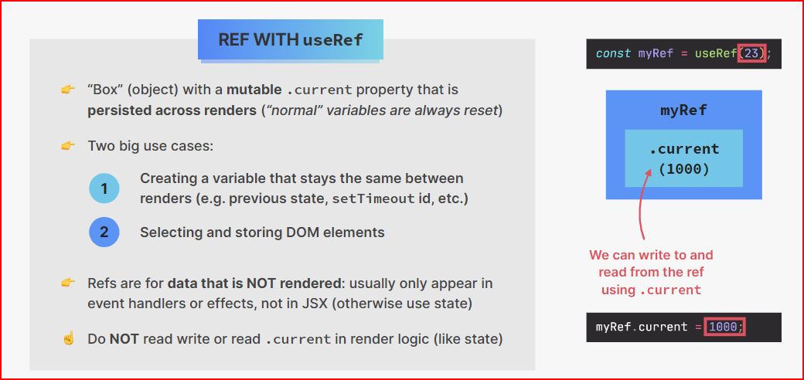

# Cour 28 : **useRef**

## 1. **Introduction:**

-   **Définition**

    > `useRef` est un hook React qui **retourne un objet mutable** dont la propriété `.current` persiste entre les rendus.

-   Il est souvent utilisé pour :

    -   Référencer **directement un élément DOM** (comme `document.getElementById` en vanilla JS).
    -   **Stocker une valeur mutable** sans déclencher de re-render (contrairement à `useState`).

-   **Syntaxe :**

    ```jsx
    import { useRef } from "react";

    const refContainer = useRef(initialValue);
    ```

    -   `initialValue` : valeur initiale (souvent `null` si on cible un élément DOM).
    -   L’objet retourné est `{ current: initialValue }`.

-   **Exemple complet**

    ```jsx
    import { useState, useRef, useEffect } from "react";

    function Example() {
    	const [count, setCount] = useState(0);
    	const countRef = useRef(0);

    	useEffect(() => {
    		countRef.current = count; // garde en mémoire la dernière valeur
    	}, [count]);

    	const handleClick = () => {
    		alert(`Le dernier count est : ${countRef.current}`);
    	};

    	return (
    		<div>
    			<p>Count: {count}</p>
    			<button onClick={() => setCount((c) => c + 1)}>
    				Incrémenter
    			</button>
    			<button onClick={handleClick}>Afficher dernier count</button>
    		</div>
    	);
    }
    ```

## 2. **Utilisation / use cases**

-   **Accéder à un élément DOM**

    On attache la ref à un élément React via l’attribut `ref` :

    ```jsx
    const inputRef = useRef(null);

    useEffect(() => {
    	inputRef.current.focus(); // met le focus à l’input au chargement
    }, []);

    return <input ref={inputRef} />;
    ```

-   **Stocker une valeur mutable entre les renders**

    Par exemple, compter combien de fois le composant a été rendu :

    ```jsx
    const renderCount = useRef(0);

    useEffect(() => {
    	renderCount.current += 1;
    });
    ```

## 3. **Différence entre `useState` et `useRef`**

| **Aspect**            | `useState`                                     | `useRef`                                                                   |
| --------------------- | ---------------------------------------------- | -------------------------------------------------------------------------- |
| Re-render déclenché ? | Oui, quand on appelle `setState`               | Non, modifier `.current` ne relance pas le rendu                           |
| Usage principal       | Stocker des **valeurs visibles dans le rendu** | Stocker des **valeurs persistantes non visibles** ou une **référence DOM** |
| Exemple typique       | Un compteur, un toggle UI                      | Une ref vers un input, garder en mémoire un ID de timer                    |


