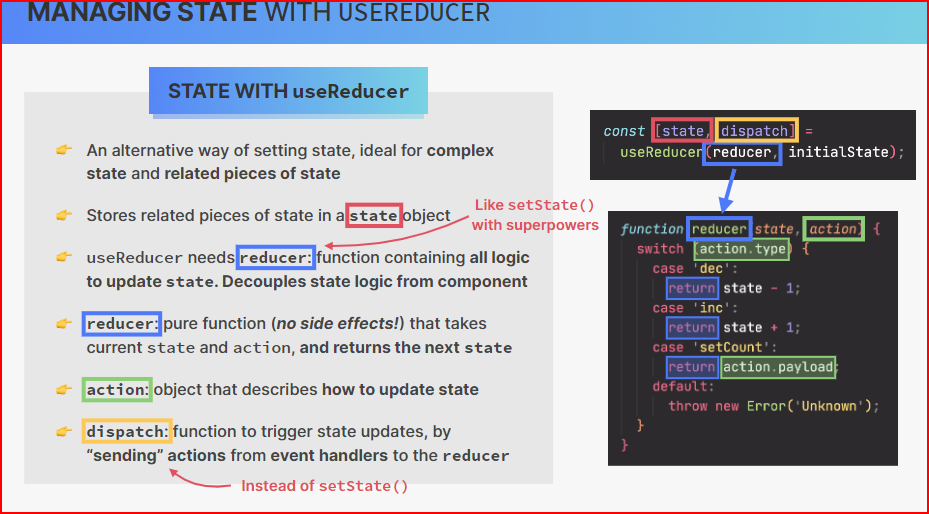

# Cour 29 : **useReducer**

## 1. **Introduction:**

-   **Définition:**

    > `useReducer` est un **hook React** permettant de gérer l'état d'un composant avec une logique centralisée, basée sur un **reducer** (comme dans Redux).

-   Il est particulièrement utile quand :

    -   l’état est **complexe ou imbriqué** (objets, tableaux, formulaires)
    -   plusieurs actions peuvent modifier le même état
    -   tu veux **mieux organiser** la logique d’état

-   **Syntaxe:**

    ```js
    const [state, dispatch] = useReducer(reducer, initialState);
    ```

    -   **`state`** : état courant
    -   **`dispatch`** : fonction qui envoie une `action`
    -   **`reducer(state, action)`** : fonction pure qui retourne le **nouvel état**
    -   **`initialState`** : état initial

-   **Exemple simple:**

    ```jsx
    import React, { useReducer } from "react";

    const initialState = { count: 0 };

    function reducer(state, action) {
    	switch (action.type) {
    		case "increment":
    			return { count: state.count + 1 };
    		case "decrement":
    			return { count: state.count - 1 };
    		default:
    			return state;
    	}
    }

    function Counter() {
    	const [state, dispatch] = useReducer(reducer, initialState);

    	return (
    		<>
    			<p>Compteur : {state.count}</p>
    			<button onClick={() => dispatch({ type: "increment" })}>
    				+
    			</button>
    			<button onClick={() => dispatch({ type: "decrement" })}>
    				-
    			</button>
    		</>
    	);
    }
    ```

### RQ : **Différence entre `useState` et `useReducer`**

| Critère              | `useState`                    | `useReducer`                                        |
| -------------------- | ----------------------------- | --------------------------------------------------- |
| Complexité de l’état | Simple                        | Complexe (objets, tableaux, logique conditionnelle) |
| Organisation         | Local à chaque champ          | Centralisée avec une fonction `reducer`             |
| Nombre d’actions     | 1 à 2                         | Nombreuses (ex: CRUD)                               |
| Préféré quand...     | États simples ou indépendants | États liés ou actions multiples                     |
| Style                | Déclaratif                    | Impératif (type/action logique)                     |


