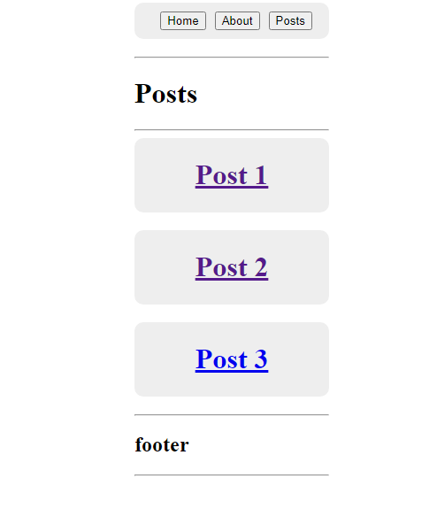
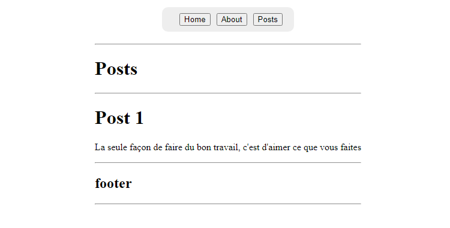
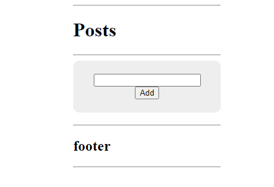

# cour 17 :**Nested Router:**

## 1. **Introduction:**

-   **Description:**

    > En React Router, un `nested router` (route imbriquée) permet de définir des routes imbriquées au sein d'une application, ce qui permet une meilleure organisation et une navigation plus complexe au sein de l'application.

    -   Les routes imbriquées permettent de structurer une application en plusieurs couches de routes. Chaque route peut avoir ses propres sous-routes, ce qui facilite la gestion de l'état et la composition de l'interface utilisateur. Cela est particulièrement utile pour les applications à plusieurs niveaux de navigation.

-   **Syntaxe:**

    ```jsx
    <Route path="/parentpath" element={<Layout />}>
    	<Route index element={<Component1 />} />
    	<Route path="childpath" element={<Component2 />} />
    </Route>
    ```

    -   la composante `<Layout />` sera rendu dans toutes les routes imbriquées ce qui donne une `layout génerique` pour toutes les routes imbriquées

    -   le mot clés `index` signifie que si l'utilisateur visite le url `/parentpath` la composante `<Component1 />` sera rendu .

    -   si l'utilisateur visite le url `/parentpath/childpath` la composante `<Component2 />` sera rendu .

-   **Exemple:**

    ```jsx
    <Route path="/posts" element={<PostLayout />}>
    	<Route index element={<Posts />} />
    	<Route path=":postId" element={<PostDetailles />} />
    	<Route path="new" element={<AddPost />} />
    	<Route path="remove" element={<RemovePost />} />
    </Route>
    ```

## 2. **`Outlet`:**

-   **Description:**

    > Le composant `Outlet` dans React Router est utilisé pour rendre des composants enfants dans des routes imbriquées. Il sert de "point de sortie" pour les routes enfants au sein de la route parente.

    -   `Outlet` est un composant fourni par React Router qui rend le contenu des routes imbriquées. Lorsque vous avez une structure de routes imbriquées, le composant `Outlet` sert de **`conteneur où les routes enfants seront rendus`**. Cela permet de créer des mises en page imbriquées et de gérer facilement les sous-routes dans une application.

-   **Syntaxe:**

    ```jsx
    <Route path="/parentpath" element={<Layout />}>
    	<Route index element={<Component1 />} />
    	<Route path="childpath" element={<Component2 />} />
    </Route>
    ```

    -   dans **`Layout.jsx`** il faut utiliser la composante `Outlet` pour que le contenu des routes imbriquées soit rendu :

        ```jsx
        import { Outlet } from "react-router-dom";

        export default function Layout() {
            return (
                <>
                    // === Header génerqiue par exemple ========
                    <Header />
                    // rendu duroute imbriquées :
                    <Outlet />
                    // footer génerique par exemple :
                    <Footer />
            );
        }
        ```

        -   donc si l'utilisateur visite `/parentpath/childpath` le contentu du child-Component(`<Component2 />`) sera rendu mais en plus le contenu des ` <Header />` et `<Footer />`

-   **Exemple:**

    ```jsx
    // ================================== PostLayout ==========================
    import { Outlet } from "react-router-dom";

    export default function PostLayout() {
    	return (
    		<>
    			<div>
    				<hr />
    				<h1>Posts</h1>
    				<hr />
    			</div>

    			<div>
    				<Outlet />
    			</div>

    			<div>
    				<hr />
    				<h2>footer</h2>
    				<hr />
    			</div>
    		</>
    	);
    }

    // ============================== Dans App.jsx =======================================

    <Route path="/posts" element={<PostLayout />}>
    	<Route index element={<Posts />} />
    	<Route path=":postId" element={<PostDetailles />} />
    	<Route path="new" element={<AddPost />} />
    	<Route path="remove" element={<RemovePost />} />
    </Route>;
    ```

    -   si l'utilisateur visite `/posts`

        

    -   si l'utilisateur visite `/posts/1`

        

    -   si l'utilisateur visite `/posts/new`

        
