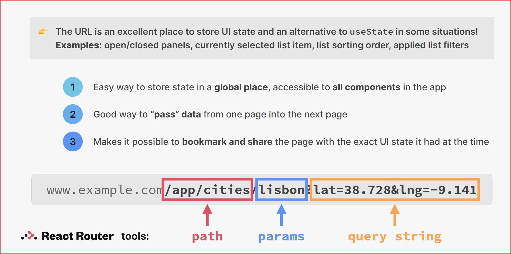

# Cour : **Router dynamique**

## 1. **Le routing dynamique en React:**

-   **Description:**

    > Le routing dynamique en React permet de créer des routes qui changent en fonction des données ou des paramètres dynamiques. React Router, la bibliothèque standard pour le routing dans les applications React, offre des fonctionnalités puissantes pour créer des routes dynamiques.

-   Le routing dynamique est utile pour des scénarios tels que :

    -   Afficher des pages de détails pour différents éléments (par exemple, les profils des utilisateurs).
    -   Créer des chemins URL basés sur les données (par exemple, `/posts/:postId`).

-   **Syntaxe:**

    ```jsx
    <Routes>
    	<Route path="/chemin1/:nomVar" element={<Component />} />
    </Routes>
    ```

    -   `/:nomVar` : indique que le `path` spécifie est un `router` dynamique qui change selon la valeur du `nomVar`

-   **Exemple:**

    Supposons que nous avons une application avec une liste d'articles, et nous voulons afficher les détails de chaque article lorsqu'un utilisateur clique sur un article spécifique.

    ```jsx
    import React from "react";
    import { BrowserRouter as Router, Routes, Route } from "react-router-dom";
    import Home from "./Home";
    import Article from "./Article";

    const App = () => {
    	return (
    		<Router>
    			<Routes>
    				<Route path="/" element={<Home />} />
    				<Route path="/article/:id" element={<Article />} />
    			</Routes>
    		</Router>
    	);
    };

    export default App;
    ```

## 2. **state dans l’URL:**

-   **Concept:**

    > Stocker le **state dans l’URL** avec **React Router** est une pratique courante pour rendre une application web plus **navigable, partageable et persistante**.

    -   Au lieu de stocker certaines données de l’état (state) dans un `useState`, `useContext`, ou `Redux`, on encode ces données **dans l’URL**, généralement via :

        -   **query params** : `/search?query=apple&page=2`
        -   **path params** : `/user/123`

    Cela permet de reconstruire l’état de l’application **à partir de l’URL seule**, sans dépendre d’un état mémoire local ou global.

-   **Avantages:**

    | Avantage                                | Description                                                                                  |
    | --------------------------------------- | -------------------------------------------------------------------------------------------- |
    | 🔗 **Partageable**                      | L'utilisateur peut partager un lien avec un état précis (ex. un filtre actif sur une table). |
    | ♻️ **Persistant**                       | L'état ne disparaît pas au refresh , contrairement au state local.                           |
    | 📌 **Navigable**                        | L'utilisateur peut utiliser les boutons précédent/suivant du navigateur.                     |
    | 🧪 **Débogage facile**                  | On peut comprendre l’état d’un composant en lisant simplement l’URL.                         |
    | 🚀 **SEO friendly** (dans certains cas) | Si les pages sont servies côté serveur, les URL uniques peuvent aider au SEO.                |



<!--  -->
