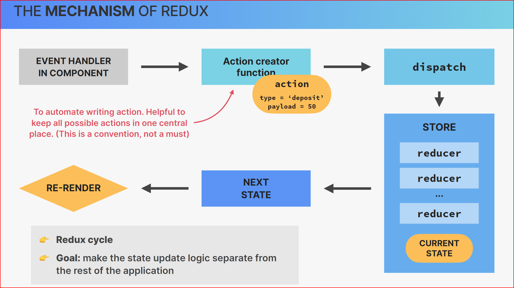

# **Cours d’introduction à Redux**

## 1. **Définition**

> **Redux** est une bibliothèque JavaScript de gestion d’état, principalement utilisée avec les bibliothèques d’interface utilisateur comme **React**. Elle permet de centraliser l’état de l’application dans un **store** unique, facilitant ainsi la gestion prévisible, le débogage et la maintenance du code. Redux repose sur un modèle inspiré de l’architecture **Flux** de Facebook, basé sur l’unidirectionnalité des flux de données.

-   **Principes :** Redux repose sur trois **principes fondamentaux** :

    -   **Single source of truth** : L’état global de l’application est stocké dans un **unique objet JavaScript**, appelé **store**.
    -   **State is read-only** : Le seul moyen de modifier l’état est d’envoyer une **action**, un objet décrivant ce qui s’est passé.
    -   **Changes are made with pure functions** : Pour spécifier comment l’état change en réponse à une action, on écrit des **reducers**, qui sont des fonctions pures.

-   Redux est particulièrement utile dans les cas suivants :

    -   Applications à **état complexe ou partagé** entre plusieurs composants (par exemple : panier d’achat, authentification, données utilisateur).
    -   Lorsque plusieurs composants doivent **accéder au même état global** ou déclencher des modifications.
    -   Pour assurer une **traçabilité** des modifications de l’état (utile pour le débogage et les tests).
    -   Pour des **applications SPA (Single Page Application)** avec beaucoup d’interactions ou de logique métier.

## 2. **Éléments de Redux**

-   **initState**

    -   L’**initState** (état initial) est la **valeur par défaut** de l’état géré par le reducer. Il représente la configuration de départ de l’état global de l’application. C’est ce que retourne le reducer si aucun état précédent n’est fourni (comme au moment de l’initialisation du store).

-   **Reducer**

    -   Un **reducer** est une fonction **pure** qui prend en entrée l’**état actuel** et une **action**, et qui retourne un **nouvel état**. Il ne doit jamais modifier l’état directement, mais retourner une nouvelle copie modifiée de l’état.

    -   Les reducers sont utilisés par le store pour **calculer le nouvel état** après chaque action.

-   **Action :**

    -   Une **action** est un **objet JavaScript** qui décrit un événement qui s’est produit dans l’application. Elle a obligatoirement une propriété `type`, souvent une chaîne de caractères, qui identifie l’action. D’autres propriétés peuvent être ajoutées pour passer des données.

-   **Store :**

    -   Le **store** est l’objet central de Redux. Il contient l’**état global** de l’application, fournit des méthodes pour accéder à l’état (`getState()`), pour envoyer des actions (`dispatch()`), et pour s’abonner aux changements (`subscribe()`).

    -   Il est unique dans l’application, ce qui garantit une vue cohérente de l’état.

## 3. **How Redux Works – Lifecycle**

Le cycle de fonctionnement de Redux peut être résumé en 4 étapes principales :

-   **Initialisation** :

    -   Le store est créé avec un reducer et un état initial (**initState**).
    -   L’application lit l’état via `store.getState()`.

-   **Dispatch d’une action** :

    -   Lorsqu’un événement utilisateur ou système se produit, une **action** est créée et envoyée au store via `dispatch(action)`.

-   **Traitement par le reducer** :

    -   Le **reducer** reçoit l’état actuel et l’action.
    -   Il calcule et retourne un **nouvel état** sans modifier directement l’ancien.

-   **Mise à jour et notification** :

    -   Le store **met à jour l’état global**.
    -   Les **composants abonnés** au store sont notifiés du changement et peuvent se re-render.

