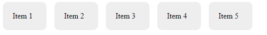
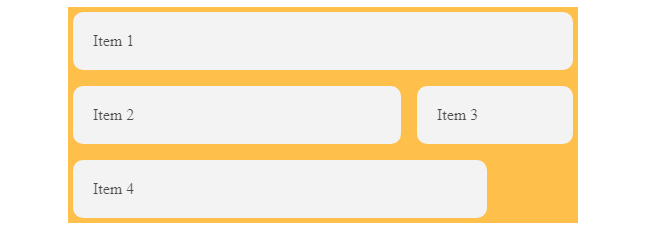

# cour 03 : **Layout**

> Material-UI offre plusieurs composants pour gérer le layout de votre application React. Les principaux composants utilisés pour organiser le contenu sont `Container`, `Stack`, et `Grid`. Chacun de ces composants a des fonctionnalités spécifiques pour faciliter la création de mises en page réactives et bien structurées.

## 1. **Container**

-   **Description** :

    -   `Container` est un composant utilisé pour centrer le contenu horizontalement sur la page. Il applique également des marges automatiques et une largeur maximale fixe ou fluide.

-   **Syntaxe** :

    ```jsx
    import { Container } from "@mui/material";

    const MyComponent = () => (
        <Container maxWidth="sm">
            <h1>Contenu Centré</h1>
            <p>
                Ceci est un exemple de contenu centré avec le composant
                Container de Material-UI.
            </p>
        </Container>
    );
    ```

    -   maxWidth : `sm` , `lg` , `md`

-   **Exemple** :

    ```jsx
    import Container from "@mui/material/Container";

    import "./style.css";
    export default function ContainerTest() {
        return (
            <>
                <Container
                    maxWidth="sm"
                    style={{
                        background: "green",
                    }}
                >
                    <div className="card">Item 1</div>
                    <div className="card">Item 2</div>
                    <div className="card">Item 3</div>
                    <div className="card">Item 4</div>
                    <div className="card">Item 5</div>
                </Container>
            </>
        );
    }
    ```

    

## 2. **Stack:**

-   **Description** :

    -   `Stack` est un composant de layout flexible qui permet d'aligner les éléments verticalement (ou horizontalement) avec des espacements configurables. C'est utile pour créer des mises en page linéaires.

-   **Syntaxe** :

    ```jsx
    import { Stack } from "@mui/material";

    const MyComponent = () => (
        <Stack spacing={2}>
            <div>Élément 1</div>
            <div>Élément 2</div>
            <div>Élément 3</div>
        </Stack>
    );
    ```

-   **Exemple** :

    ```jsx
    import Stack from "@mui/material/Stack";
    import "./style.css";
    export default function StackTest() {
        return (
            <>
                <Stack spacing={2} direction={"row"}>
                    <div className="card">Item 1</div>
                    <div className="card">Item 2</div>
                    <div className="card">Item 3</div>
                    <div className="card">Item 4</div>
                    <div className="card">Item 5</div>
                </Stack>
            </>
        );
    }
    ```

    

### 3. **Grid**

-   **Description** :

    -   `Grid` est un système de grille flexible qui permet de créer des mises en page complexes et réactives. Il utilise un système de grille à 12 colonnes, avec des éléments enfants configurables en utilisant les propriétés de colonnes.

-   **Syntaxe** :

    ```jsx
    import { Grid } from "@mui/material";

    const MyComponent = () => (
        <Grid container spacing={2}>
            <Grid item xs={6}>
                <div>Colonne 1</div>
            </Grid>
            <Grid item xs={6}>
                <div>Colonne 2</div>
            </Grid>
        </Grid>
    );
    ```

-   **Exemple** :

    ```jsx
    import Grid from "@mui/material/Grid";
    import "./style.css";
    export default function GridTest() {
        return (
            <>
                <Grid container spacing={2}>
                    <Grid item xs={12}>
                        <div className="card">Item 1</div>
                    </Grid>
                    <Grid item xs={8}>
                        <div className="card">Item 2</div>
                    </Grid>
                    <Grid item xs={4}>
                        <div className="card">Item 3</div>
                    </Grid>
                    <Grid item xs={10}>
                        <div className="card">Item 4</div>
                    </Grid>
                </Grid>
            </>
        );
    }
    ```

    
